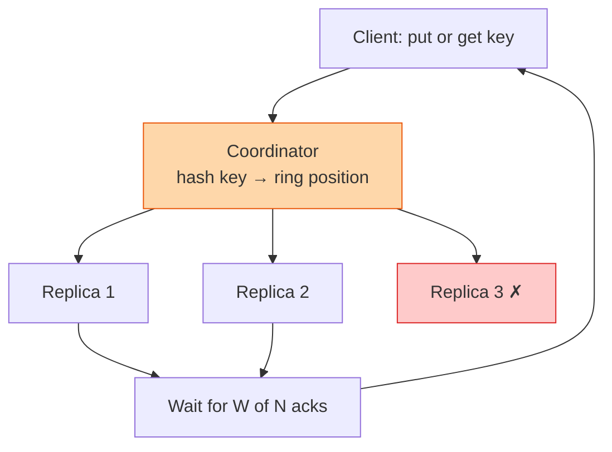

## The question

Design a distributed key-value store. Put a value under a key. Get it back. Terabytes of data, many machines, some of which are always broken.

## Explain it to a ten-year-old

Imagine a school where every child's coat is in a locker with their name on it. One wall of lockers is not enough for the whole school, so you spread them over ten walls, and the first letter of your name tells you which wall. Now, what if one wall collapses? So every coat is kept in three lockers on three different walls. When you hang up a new coat, you must put it in all three. When you fetch it, you can ask any of them. The tricky part is when you changed coats this morning and one wall did not get the memo yet.

## The trick

Three knobs: N copies of each key, W of them must confirm a write, R of them must answer a read. If W plus R is greater than N, every read overlaps at least one fresh write. Set W and R and you have chosen your consistency. Say those three letters and the interviewer relaxes.

## The steps

1. **Say the number.** Ten terabytes, values of a kilobyte, that is ten billion keys. One machine holds maybe a terabyte in practice. So ten machines minimum, thirty with three copies.
2. **Partition.** Hash the key onto a ring and let each machine own a range of the ring. Adding a machine moves only a slice of keys, not everything. That is consistent hashing and it deserves its own lesson.
3. **Replicate.** Write each key to the owning machine and the next two on the ring. Three copies on three different racks, or you have three copies of the same power failure.
4. **Quorum.** N equals 3. W equals 2 and R equals 2 gives you strong-ish reads at the cost of latency. W equals 1 and R equals 1 is fast and sometimes stale. Say which the customer wants.
5. **Conflicts.** Two clients wrote the same key on two sides of a network split. Keep a version per write, either a vector clock or last-writer-wins with a timestamp. Last-writer-wins loses data quietly. Say that.
6. **Failure.** A replica is down during a write. Hand its copy to the next machine on the ring with a note to pass it on when the owner returns. Hinted handoff. Run a background job that compares copies and repairs the differences.
7. **On disk.** Append writes to a log, keep a sorted memory table, flush it to sorted files, and merge them in the background. That is an LSM tree and it is why writes are fast.

## What I am listening for

- Whether N, W, R come out. It is the vocabulary of the whole subject.
- Whether you know where your copies are physically. Three replicas in one rack is one replica.
- What happens to a write when the network splits. If you say "it cannot happen", we spend the rest of the hour on why it can.


- **Hash keys onto a ring. Replicate to the next N machines.**
- **W + R > N** and you always read something fresh.
- **Three copies on three racks**, or it is one copy.
- **Split brain means conflicts.** Version every write and decide how to merge.


## Go deeper

- [Amazon's Dynamo paper](https://www.allthingsdistributed.com/2007/10/amazons_dynamo.html) is the source of most of this vocabulary. Short and readable.
- Martin Kleppmann's [Designing Data-Intensive Applications](https://martin.kleppmann.com/) chapter on replication, if you read nothing else.

**With AI on the table.** The assistant will recite Dynamo. I ask you to pick W and R for a shopping cart, and then for a bank balance, and to explain the difference to a product manager in two sentences. That is the job.
