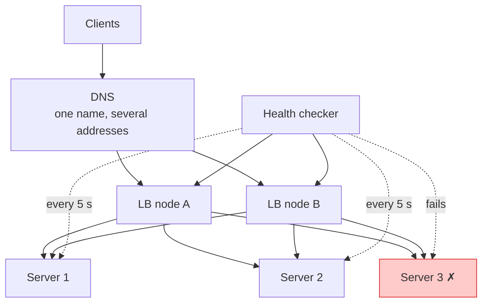

## The question

Design a load balancer that sits in front of a fleet of web servers. It must spread traffic, stop sending traffic to dead servers, and never be a single point of failure itself.

## Explain it to a ten-year-old

A busy restaurant has one host at the door and twenty waiters. The host does not cook. The host looks at who is free, sends you to a table, and moves on to the next guest. Every few minutes the host peeks into the kitchen to see which waiters actually turned up today, and stops sending guests to the empty tables. That host is the load balancer. The clever bit is the last question: what if the host gets sick? A good restaurant has two hosts and a sign outside that points to whichever one is standing.

## The trick

Split the problem in three: how to pick a server, how to know a server is alive, and how to keep the balancer itself alive. Candidates spend all their time on the first and it is the least interesting.

## The steps

1. **Picking.** Round robin is fine to start. Least connections is better when requests are uneven. Consistent hashing when the same client must land on the same server (sessions, caches).
2. **Layer.** Layer 4 balances TCP connections and is fast and dumb. Layer 7 reads HTTP and can route by path, terminate TLS, retry. Say which you are building and why.
3. **Health checks.** Active: the balancer pings each server every few seconds and takes it out after N failures. Passive: the balancer watches real responses and ejects on errors. Use both. Bring a server back slowly, not all at once.
4. **The balancer's own availability.** Several balancer nodes behind one DNS name, or one floating IP that moves on failure. No shared state between nodes, so any of them can die.
5. **Scale.** Balancer nodes are stateless, so add more. The state that matters, which servers are healthy, is cheap to recompute on every node.

## In GPU infrastructure

Inference serving is this drawing with GPUs behind the host. A request is spread across GPU replicas, and the health check is not a TCP ping but a tiny forward pass, because a GPU with an XID error will happily accept a connection and then return garbage. Slow beats dead here too: a node with one degraded NVLink still answers, at three times the latency, and least connections is what quietly pulls traffic off it. The same shape sits in front of the bastions that run health checks across the fleet, so that one bastion dying does not stop the checks.

## What I am listening for

- Do you ask what "traffic" means: connections per second, bytes per second, or requests per second. They need different designs.
- Do you draw the health checker as its own thing. It is the part that actually decides your availability.
- The follow-up: a server is slow but not dead. Half its requests time out. What does your design do? Slow is harder than dead.


- **Three questions: pick, detect, survive.**
- **L4 is fast and blind, L7 is smart and expensive.**
- **Health checks decide availability.** Active plus passive. Eject fast, readmit slowly.
- **Who balances the balancer?** DNS or floating IP, stateless nodes.


**With AI on the table.** An assistant will produce the textbook diagram in a second. So I give it a real incident: one balancer node has a stale health table and keeps sending 5 percent of traffic to a dead server. Walk me through how you find it and how the design should have prevented it.

## Go deeper

- [Amazon Builders' Library](https://aws.amazon.com/builders-library/). The articles on health checks and load shedding are written by the people who ran the thing.
- [My own notes from the ALB launch](/posts/aws-alb-launch-2016/). And the NLB launch a year later at /posts/aws-nlb-launch-2017/.
