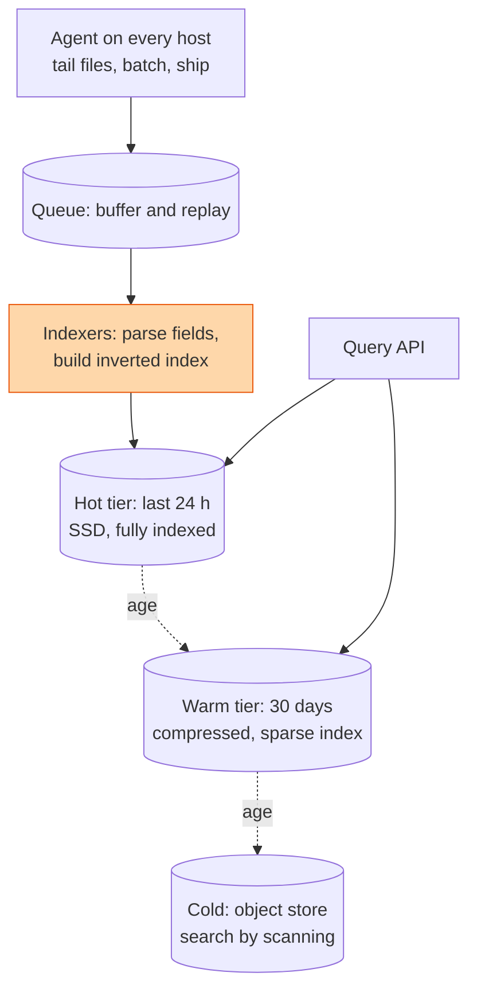

## The question

Design a system that collects logs from a fleet of a hundred thousand servers and lets engineers search them by text, by field, and by time.

## Explain it to a ten-year-old

Every child in a huge school writes a diary, dozens of lines a minute. The headteacher wants to find every line anyone wrote that mentions "lost jumper" between two and three o'clock. You cannot read every diary. So helpers collect the pages every minute, and a librarian makes an index: for every word, the list of pages that contain it. Now "lost jumper, two to three" is a look-up, not a read. And because the cupboard is not infinite, last year's diaries go into boxes in the basement, and the year before that gets recycled.

## The trick

Logs are written a million times more than they are read. So the write path must be dumb and cheap and the storage must be tiered by age. Index only what people actually search by, which is the request id, the host, the service and the level, plus full text on the hot tier. Everything older than a day gets a cheaper index. Everything older than a month gets no index, only a scan. Retention is a design decision, not a cleanup job.

## The steps

1. **Say the number.** A hundred thousand hosts, a thousand lines a second, two hundred bytes a line. That is twenty gigabytes a second and 1.7 petabytes a day. Say it out loud so everyone in the room understands why this is not one database.
2. **Agent.** Tails the log files, batches lines, compresses, ships. Buffers to local disk if the collector is unreachable. Never blocks the application.
3. **Queue.** The shock absorber between a hundred thousand agents and a few hundred indexers. Falling behind is fine. Losing lines is not.
4. **Indexers.** Parse structured fields. Build an inverted index, word to document list, per time-sharded index. Shard by time so a query for the last hour touches a handful of shards.
5. **Tiers.** Hot on SSD with a full index for a day. Warm on cheap disk with only field indexes for a month. Cold in an object store as compressed blobs you can scan when a lawyer asks.
6. **Query.** Time range first, always. It prunes shards before anything else runs. Then fields, then text. Fan the query to the matching shards, merge, return the top N, stream the rest.
7. **Sampling.** Debug logs at ten percent, errors at a hundred. You will not miss the ninety percent and you will save most of the bill.

## What I am listening for

- Whether you say the daily volume. If you did not, your design is for a small company.
- Whether time is the first filter. Text-first search over petabytes is a demo, not a system.
- Whether retention and tiers appear. Keeping everything forever is a design that ends in a budget meeting.


- **Say the number: hosts × lines × bytes. It is petabytes a day.**
- **Dumb write path, queue, indexers, tiers by age.**
- **Time range first.** Then fields, then text.
- **Retention is a design decision.**


## Go deeper

- The [Google SRE book](https://sre.google/sre-book/table-of-contents/) chapter on monitoring distributed systems, for what logs are actually for.
- [Elasticsearch documentation](https://www.elastic.co/guide/index.html) on index lifecycle management, for how hot-warm-cold is done in practice.

**With AI on the table.** The assistant draws the ELK stack. I ask what you cut first when the bill doubles and the volume triples, and how you find the one request id from three weeks ago after you cut it. Retention is where the design meets the money.
