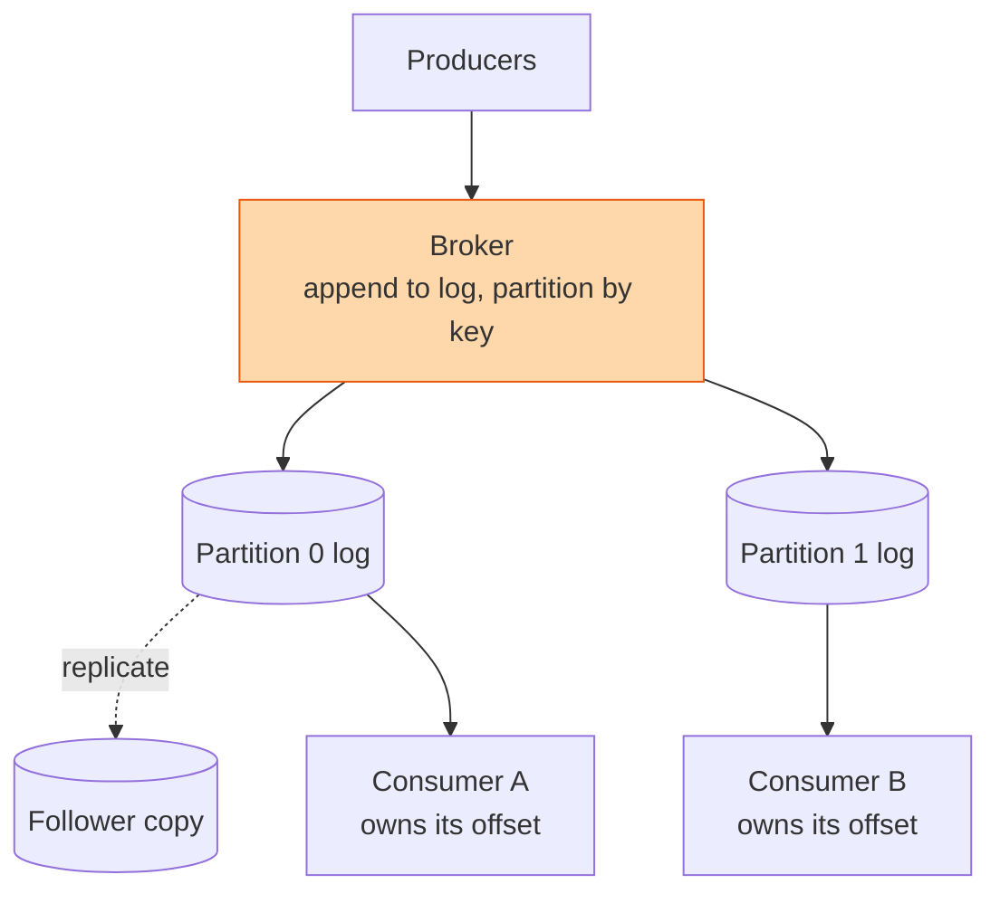

## The question

Design a message queue. Producers put messages in. Consumers take them out later. No message may be lost, and the queue must survive a machine dying.

## Explain it to a ten-year-old

You write a note for your friend but they are at football practice. You do not stand at their door for two hours. You put the note in their post box and go home. When they get back, they read every note in the order it arrived. The post box is the queue. It lets you and your friend live on different timetables. The nightmare is a post box that a fox gets into. So you make two post boxes and put every note in both.

## The trick

A queue is just a file you only append to. Consumers remember how far they have read, as a number called the offset. The broker never deletes on read, it deletes on age. That one decision means many consumers can read the same messages, a crashed consumer can rewind, and the broker's job is only to write fast and replicate the file.

## The steps

1. **Say the number.** A hundred thousand messages a second at a kilobyte each is a hundred megabytes a second. One disk can append that. Ten partitions on ten machines is comfortable.
2. **Partitions.** Split the stream into partitions by a key, say customer id. Order is guaranteed inside a partition, not across them. That is the only order anyone really needs.
3. **Durability.** Each partition is a log on disk, replicated to two followers. A write is acknowledged when a majority have it. Lose a machine and a follower becomes leader.
4. **Consumers.** Each consumer group keeps an offset per partition. Commit the offset after processing, not before, or a crash loses a message. That means at-least-once delivery and idempotent consumers, same as the job scheduler lesson.
5. **Back pressure.** Consumers that fall behind do not slow producers. The log just gets longer. Set a retention window and alert when a consumer's lag approaches it.
6. **Dead letters.** A message that fails processing ten times goes to a separate queue a human looks at. Otherwise one poison message stops the line forever.

## What I am listening for

- Whether the queue deletes on read. If it does, I ask how two teams both consume the same events.
- Whether you commit the offset before or after the work. This is the whole difference between losing and duplicating.
- Whether you say "ordered" without saying "per partition". Global order is a trap.


- **Append-only log plus a consumer offset.** That is the whole design.
- **Order inside a partition only.**
- **Commit the offset after the work.** At least once, so consumers must be idempotent.
- **Poison messages go to a dead-letter queue.**


## Go deeper

- The [Apache Kafka documentation](https://kafka.apache.org/documentation/) introduction explains the log-and-offset idea in a few pages.
- Martin Kleppmann's [Designing Data-Intensive Applications](https://martin.kleppmann.com/) chapter on stream processing.

**With AI on the table.** The assistant draws Kafka. I ask what happens to consumer A's offset when partition 0's leader dies mid-batch, and whether the messages it was holding get processed twice, once, or never. Trace it, do not guess.
