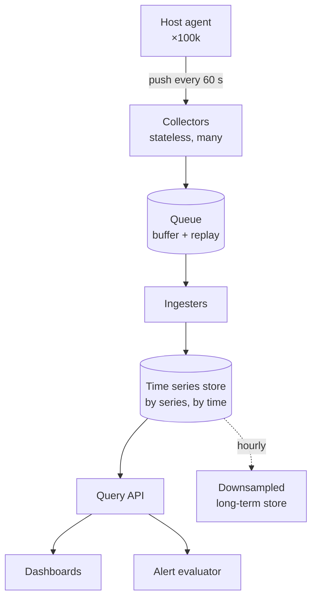

## The question

Design a system that collects metrics (CPU, memory, errors, anything numeric) from a hundred thousand hosts, stores them, and lets engineers graph and alert on them.

## Explain it to a ten-year-old

Imagine every child in a very large school writes one line in a diary every minute: "10:01, feeling 7 out of 10, ate 2 snacks". The headteacher wants to know, right now, which children are feeling under 3. You cannot walk to every classroom. So each classroom has a helper who collects the diaries and posts them to the office. The office files them by child and by time, so that "everyone under 3 in the last five minutes" is one quick look, not a hundred thousand.

## The trick

Separate the write path from the read path and make the write path as stupid as possible. Every clever idea you add to ingestion is a place where a hundred thousand hosts can pile up behind a slow lock. Put the cleverness in the store's layout and in the query layer.

## The steps

1. **Numbers first.** A hundred thousand hosts, a hundred metrics each, once a minute is about 170,000 points per second. Say the number. It tells you a single box will not do.
2. **Agent.** A small process on each host that batches metrics and pushes them. Push, not pull, at this scale: the fleet changes too fast for a central list of who to scrape.
3. **Collectors and a queue.** Stateless collectors accept the batch and drop it on a queue. The queue is your shock absorber: if the store is slow, nothing is lost, it just arrives late.
4. **The store.** Key by series (host, metric name, labels) and by time. Compress by delta, most values barely change minute to minute. Keep the last few hours hot in memory, the rest on disk.
5. **Cardinality.** The enemy. One engineer adds a label with the request ID and creates a million new series. Cap labels per metric and reject at the collector.
6. **Downsample.** Per-minute data for two weeks, per-hour for a year. Nobody needs a minute of resolution from last March.
7. **Alerts.** A separate evaluator that runs each rule on a schedule against the store. Never in the ingest path.

## What I am listening for

- Whether you say the throughput number before you draw a box.
- Whether the word "cardinality" appears. It is what actually kills metrics systems in production.
- What happens when the store is down for ten minutes. Do you lose the data, or replay it?


- **Dumb write path, clever read path.**
- **Say the number:** hosts × metrics ÷ interval.
- **Queue between collectors and store.** Late beats lost.
- **Cardinality is the enemy.** Cap labels at the door.


**With AI on the table.** The assistant will draw Prometheus and call it done. I ask what happens at 3am when one region's collectors fall behind by twenty minutes and the alerts go quiet. Silence is the scariest alert. Where in your design would you notice?

## Go deeper

- [SRE Book, chapter 6: Monitoring Distributed Systems](https://sre.google/sre-book/monitoring-distributed-systems/). The four golden signals come from here.
- [Prometheus overview](https://prometheus.io/docs/introduction/overview/). Read the data model page and then the one on cardinality.
