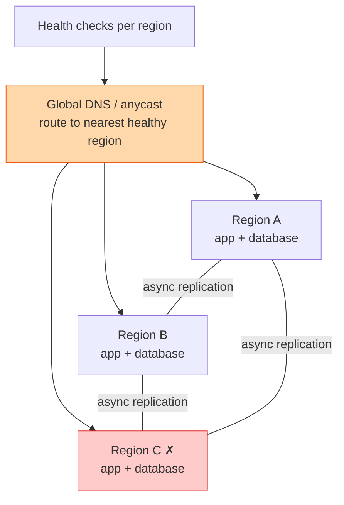

## The question

A service runs in one region. Make it run in three, all serving reads and writes, so that losing a whole region costs customers nothing. Explain what happens to the data.

## Explain it to a ten-year-old

Your family keeps a shopping list on the fridge. Now you have three houses, each with a fridge and a list, and everyone adds to whichever list is closest. Every few minutes the lists are copied to each other. Fine, until you write "buy milk" on one and your sister writes "no milk, we are away" on another in the same minute. When the copies meet, which one is right? You have to decide the rule before it happens: latest note wins, or some things may only be written on one fridge, or both notes are kept and a human sorts it out.

## The trick

Sort your data into three bins before you draw anything. Data that can be written anywhere and merged, like a shopping cart or a like count. Data that must have one owner, like a bank balance, where you pick a home region per key and route writes there. And data that is read-only outside its region, like a product catalogue. Most tables fall into the first or third bin. The hard ones are the second, and there are fewer than people think.

## The steps

1. **Routing.** DNS or anycast sends each user to the nearest healthy region. Health checks pull a region out in under a minute. Sessions must not be pinned to a region, or a failover logs everyone out.
2. **Compute.** Stateless. Same artifact in every region, deployed one region at a time as in the safe deployment lesson.
3. **Replication.** Asynchronous between regions, because synchronous across an ocean adds a hundred milliseconds to every write. Say the number: replication lag of one to five seconds is normal. That lag is the window where conflicts happen.
4. **Conflicts.** Per bin. Mergeable data uses last-writer-wins with a version, or data types that merge by design. Single-owner data routes to its home region and fails over its ownership only when that region is truly gone. Read-only data just replicates.
5. **Failover.** A region dies. Its traffic moves in a minute. Its single-owner keys are reassigned, and any writes in the replication lag window are lost. Say that out loud. Then say how the customer finds out.
6. **Failback.** The region returns with stale data. It must catch up before it takes writes, or it will overwrite fresh rows with old ones. This is where real outages happen.
7. **Test it.** Turn a region off on purpose, monthly. If you have never done it, you do not have multi-region, you have three regions and a hope.

## In GPU infrastructure

Training capacity lives in several regions and the three bins are the same. Job metadata and telemetry are mergeable and replicate freely. A node record has one owner, the region the node is racked in, and nothing else may write it. The checkpoint store is the hard one: a terabyte checkpoint written every twenty minutes cannot be replicated synchronously across an ocean, so it is single-owner in the region where the job runs, and a region failover means restarting from the last checkpoint that finished copying. Say how much training time that loses, because that is the number the customer asks.

## What I am listening for

- Whether you sort the data before you draw. Treating every table the same is the mark of a design that has not met production.
- Whether you say replication lag out loud and what it means for a failover.
- Whether failback appears. Everyone plans the failover. The failback is where you lose data.


- **Three bins: mergeable, single-owner, read-only.**
- **Async replication. Lag is the conflict window.**
- **Failover loses the lag window.** Say so.
- **Failback must catch up before taking writes.**


## Go deeper

- Amazon's builders' library on [avoiding fallback in distributed systems](https://aws.amazon.com/builders-library/avoiding-fallback-in-distributed-systems/) for why "just switch to the other region" is harder than it sounds.
- The [Google SRE workbook](https://sre.google/workbook/table-of-contents/) chapters on managing load and on non-abstract large system design.

**With AI on the table.** The assistant produces a tidy three-region picture. I ask which of your tables are single-owner, and what the customer sees for the ninety seconds between region A dying and its keys being reassigned. If you cannot name a table, the design is not finished.
