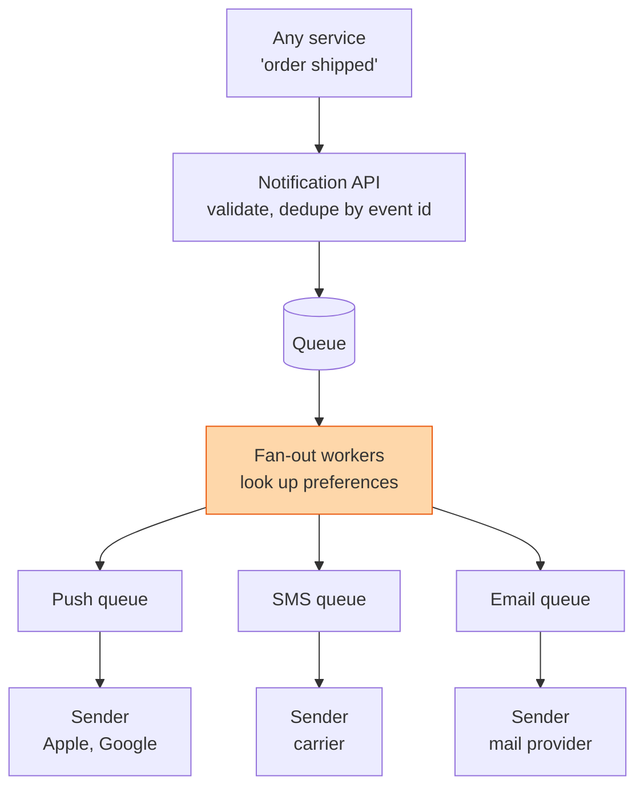

## The question

Design a system that sends notifications by push, SMS and email. Other services trigger them. Millions of users. Nobody should get the same alert twice, and everyone can switch channels off.

## Explain it to a ten-year-old

The head teacher wants to tell every family that school is closed tomorrow because of snow. She does not phone a thousand houses herself. She writes one note and hands it to the office. The office looks up each family: this one wants a text, that one wants an email, this one said "never text me after 8pm". Then helpers send them out, tick each one off, and try again if a phone did not answer. One note in, a thousand messages out, each one ticked exactly once.

## The trick

Separate the three jobs. Accept the event and give it an id. Fan it out into one row per user per channel, after checking preferences. Send each row through a per-channel worker that retries. The queue between each step is what lets a slow SMS carrier not block a fast push. The event id is what stops a retry from sending the same message twice.

## The steps

1. **Say the number.** A million users, five notifications a day each, is about sixty a second on average and maybe a thousand a second at peak. A snow-day broadcast is a million in a minute. Design for the broadcast.
2. **API.** One call: event type, recipients or a segment, payload, idempotency key. Store it and return immediately. Never make the caller wait for a carrier.
3. **Preferences.** A table per user: channel on or off, quiet hours, frequency cap. Checked at fan-out time, not at send time. Cache it, it is read a thousand times more than written.
4. **Fan-out.** One event becomes N rows, one per user per channel. Write them to per-channel queues. This is the expensive step; it scales horizontally.
5. **Senders.** Per channel, with their own retry policy. Push is cheap and fast. SMS costs money and carriers rate-limit you. Email bounces. Treat them as three different products.
6. **Dedupe.** Store the event id plus user plus channel that was sent. Check before sending. Retries and replayed queues will hand you the same row twice, and this is the only thing that stops the double text.
7. **Feedback.** Delivered, opened, bounced, unsubscribed. Write it back so the next fan-out is smarter.

## What I am listening for

- Whether the API returns before the send. Synchronous notification APIs are how one carrier outage takes down your checkout.
- Where preferences get checked. At send time is too late and too expensive.
- Whether the words "idempotency key" show up without a prompt.


- **Accept, fan out, send. A queue between each.**
- **Preferences are checked at fan-out**, and cached.
- **Per-channel senders with per-channel retries.**
- **Event id plus user plus channel is the dedupe key.**


## Go deeper

- [ByteByteGo](https://bytebytego.com/) covers this one with the same three-stage shape. Compare their diagram to yours.

**With AI on the table.** The assistant will draw the fan-out. I ask what your system does at 8:59pm when a user's quiet hours start at 9 and the SMS queue is twenty minutes behind. Send late, drop, or hold until morning? Pick one and defend it.
