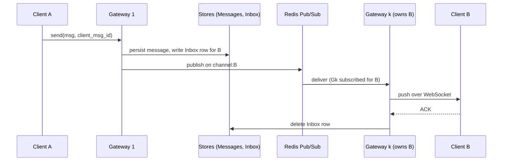

## The question

Design a messaging app. Requirements: one-to-one, text only, web app only. Anything else you want to know, ask.

That is a real opener and it is a test of requirement gathering before it is a test of architecture. The numbers you should extract, or propose if the interviewer shrugs: 100 million daily users, ten messages each per day, delivery under half a second, 99.9 percent available, single device to start, history kept.

## Explain it to a ten-year-old

A school has thirty classrooms and one post room. Every child sits in a classroom with a walkie-talkie. To send a note to a friend, you hand it to your teacher. The teacher writes it in the school ledger, drops a copy in the friend's pigeon hole, and calls the friend's classroom on the radio. If the friend is in class, their teacher reads it out straight away and the pigeon-hole copy is thrown away. If the friend is off sick, the note waits in the pigeon hole until they are back. The trick is knowing which classroom the friend is in without asking every teacher: each child's name maps to one classroom by a fixed rule.

## The trick

Two ideas carry the design. First, a **consistent hash from user id to gateway**, so the sender's gateway knows which gateway holds the recipient's socket without broadcasting. Second, an **Inbox table as the durability backstop**: write the message and the recipient's inbox row before publishing, delete the row on acknowledgement. Because the inbox exists, the fan-out bus can be at-most-once and fast. That single decision is what lets you defend Redis Pub/Sub against Kafka.

## The steps

1. **Ask.** Load, peak, latency, delivery guarantee, ordering, offline behaviour, retention, devices. Write the numbers on the board: 1 billion messages a day is about 11,600 a second average and 35,000 at peak; 10 million concurrent sockets at about a million per gateway is ten gateways; 200 bytes a message is 200 GB a day.
2. **Connection layer.** WebSocket over TLS, because both sides push. A layer-4 balancer is enough. Each gateway keeps an in-memory map from user id to socket.
3. **Finding the recipient.** Consistent hash on user id to pick the owning gateway; a coordination store (etcd or ZooKeeper) holds the ring so all gateways agree. When a gateway dies, only its slice of users reconnects elsewhere.
4. **Send path.** Persist the message in a wide-row store keyed by conversation id, write an inbox row for the recipient, publish on the recipient's channel. The owning gateway is subscribed and pushes to the socket. The client acknowledges; the gateway deletes the inbox row.
5. **Presence.** A Redis key per user with a TTL of twice the heartbeat interval, refreshed by the gateway on every ping (10 to 30 seconds, 5 second pong deadline). Offline is the key expiring. Do not write "last seen" per heartbeat: at scale that is 20 million writes a second.
6. **Offline delivery.** The recipient reconnects, reads their inbox, fetches the bodies, acknowledges, rows are deleted. Exactly-once from the client's point of view comes from deduplicating on the client message id.
7. **Ordering.** Per conversation, with server-issued monotonic ids. Global ordering is a trap; say so.
8. **The bus.** Redis Pub/Sub: a channel is a pointer to sockets, single-digit milliseconds, no per-channel metadata. Kafka: durable and replayable, tens of milliseconds with all acks, and roughly 50 KB of metadata per topic, so topic-per-user at a billion users is 50 TB of metadata. Choose Redis for fan-out and keep Kafka only if hours of replay is a hard requirement. Be ready for the Kafka internals follow-up anyway: partition as an ordered log, consumer groups and rebalance, replication and in-sync replicas, leader election, log compaction.
9. **Sharding.** Many small conversations per user: shard by user id. Few huge conversations: shard by conversation id. Hybrid above a participant threshold.
10. **Second device.** Scope the inbox by recipient and client id so each device acknowledges separately; cap devices per account.

## The board



## In GPU infrastructure

The same shape runs the control plane of a GPU fleet. Agents on ten thousand hosts hold long-lived connections to a handful of gateways; a command for one host has to find the gateway that owns it (consistent hash on host id); a host that is rebooting must not lose the command (an inbox row with a TTL); and "is the host alive" is a heartbeat key that expires on its own, never a table you write on every ping. Presence for chat and liveness for a fleet are the same Redis key.

## What I am listening for

- Whether the first five minutes are questions, not boxes.
- How the sender finds the recipient's gateway.
- Where the message is safe when the recipient is offline, and therefore why the bus can be lossy.
- Whether "last seen" is written per heartbeat.
- Whether ordering is promised per conversation or, fatally, globally.


- **Ask first.** The opener is deliberately thin.
- **Consistent hash user → gateway**, ring in etcd.
- **Write message + inbox row, then publish.** Delete on ACK.
- **Presence is a TTL key**, offline is expiry.
- **Redis Pub/Sub for fan-out**, and say why not Kafka: metadata per topic.
- **Order per conversation** with server ids.


## Go deeper

- Hello Interview's [WhatsApp breakdown](https://www.hellointerview.com/learn/system-design/problem-breakdowns/whatsapp) and the [design a chat system](https://www.hellointerview.com/community/questions/messenger-chat-system/cm4szunov00303g2e2gomqo2j) question page, which lists the deep dives interviewers actually ask.
- [Kafka's design document](https://kafka.apache.org/documentation/#design), the sections on partitions, replication and consumer groups. Read once; the follow-up will find you.
- Alex Xu, *System Design Interview*, chapter 12, the chat system.
- [Consistent Hashing](/teach/systems/consistent-hashing/), [Design a Message Queue](/teach/systems/design-a-message-queue/) and [Design a Notification System](/teach/systems/design-a-notification-system/) are the lessons this one leans on.

**With AI on the table.** The assistant will produce gateways, Kafka and Cassandra in one answer. I ask it why Kafka, then ask you what a topic costs and what the inbox table changes about the answer. The tool knows the boxes. You have to know which one is doing the durability.
