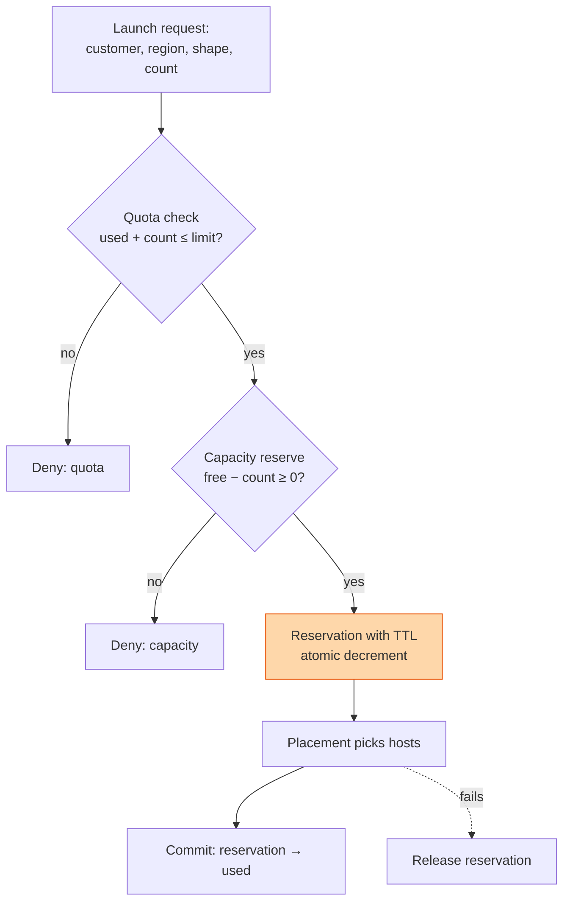

## The question

Design the system that decides whether a cloud customer may launch a new instance. It must enforce per-customer limits, know the real free capacity per region and hardware type, and never over-promise.

## Explain it to a ten-year-old

The school has a cupboard of footballs. Each class is allowed to borrow up to five. A teacher keeps two lists: how many each class has borrowed, and how many balls are actually left in the cupboard. When a child asks for a ball, the teacher checks both lists. Class already has five? No. Cupboard empty? No. Otherwise, take a ball and write it down before handing it over. The order matters. Write first, then hand over, or two children get promised the last ball.

## The trick

Three counters, not one. Limit, what the customer is allowed. Used, what they have. Reserved, what is promised but not yet placed. A request passes if used plus reserved plus count is under the limit, and if free capacity minus reserved covers it. The reservation is atomic and has a time-to-live, so a launch that dies half way gives its capacity back. This is the token bucket lesson wearing a suit.

## The steps

1. **Say the number.** A hundred regions, a thousand shapes, a million customers. Quota rows are a billion in theory but sparse in practice; most customers touch ten shapes in two regions. Launch requests are hundreds a second, not millions. Correctness matters more than speed.
2. **Quota store.** Key is customer, region, shape. Values are limit, used, reserved. Strongly consistent, because two launches racing on the last unit of quota must not both pass. A compare-and-set per row.
3. **Capacity store.** Key is region, availability domain, shape. Values are total, in use, reserved, and out of service. Fed by the fleet inventory and the health system. Stale by seconds is fine; stale by minutes over-promises.
4. **Reservation.** One atomic operation decrements free and increments reserved, with a TTL of a few minutes. Placement then finds real hosts. Commit moves reserved to used. Fail or timeout releases it.
5. **Limits change.** A customer asks for more. A human or a policy approves. Raise the limit, never touch used. Lowering a limit below current use is allowed; it only blocks new launches.
6. **Hardware is not fungible.** Sixty-four GPUs must be in one cluster on one network for the customer to want them. Capacity is counted per placement domain, not per region, or you will promise capacity that exists but is useless.
7. **Reconcile.** A background job compares used against what is actually running. Drift happens. Fix the counters, alert on the size of the drift.

## What I am listening for

- Whether the reservation step exists. Without it, check then act is a race, and you will sell the same GPU twice.
- Whether capacity is counted at the level the customer cares about. A region-wide count of free GPUs is a lie for cluster workloads.
- Whether a reconciliation loop appears. Counters drift, always.


- **Three counters: limit, used, reserved.**
- **Reserve atomically with a TTL, then place, then commit.**
- **Count capacity per placement domain**, not per region.
- **Reconcile against reality**, and alert on drift.


**With AI on the table.** The assistant will draw the quota check. I ask what happens when a rack of GPUs is pulled for repair in the burn-in lesson while three reservations on it are in flight. Which counter changes first, and what does the customer with a confirmed reservation see?
