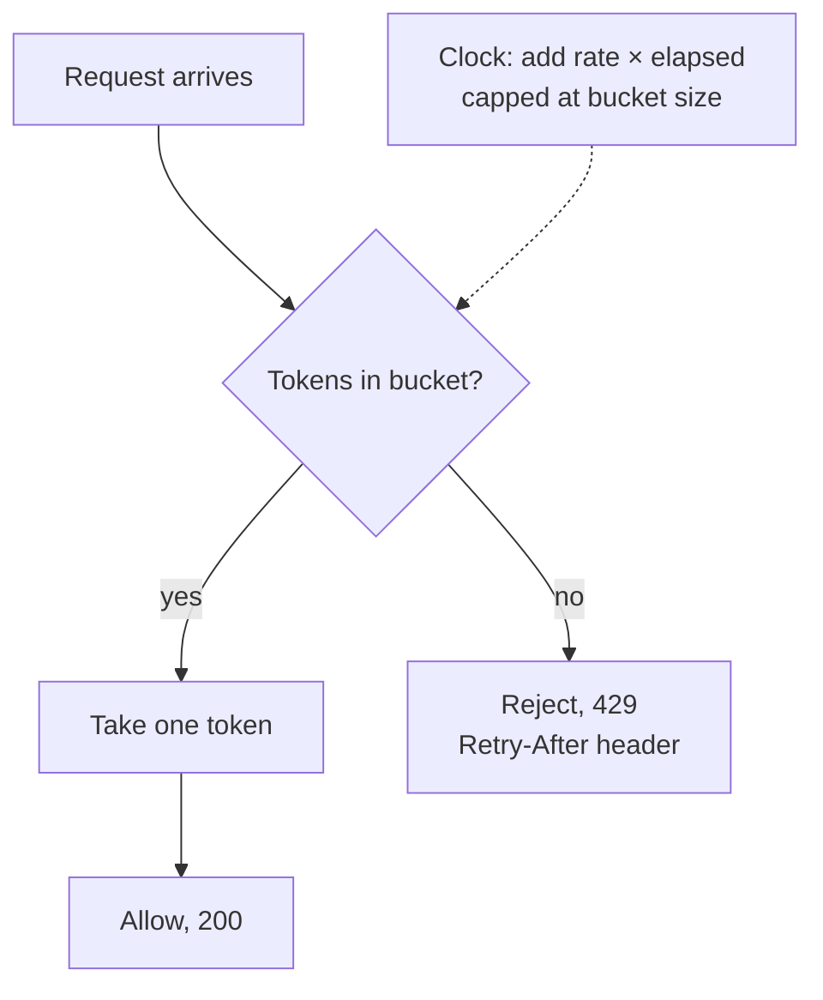

## The question

Design a service that limits each client to N requests per second across an API that runs on many servers. Requests over the limit get a polite "slow down".

## Explain it to a ten-year-old

At the fairground there is a jar of tickets by the ride. Every second someone drops ten new tickets in, but the jar only holds fifty. To ride, you take one ticket. If you show up with fifty friends at once, the first fifty ride, the rest wait until new tickets drop. That jar is a token bucket. The bucket size is how big a burst you allow. The refill rate is the steady speed you allow. Two numbers describe the whole rule.

## The trick

You do not need a timer that ticks every second. Store two numbers per client: how many tokens were in the bucket and when you last looked. On the next request, compute how many tokens should have been added since then, cap at the bucket size, and decide. Lazy refill. It makes the whole thing a single read-modify-write.

## The steps

1. **Algorithm.** Token bucket for most APIs. Sliding window log when you need exactness and can afford the memory. Fixed window is simple and has the double-burst bug at the boundary, say that out loud.
2. **Where the counter lives.** In memory on each server is fast but every server has its own jar, so the real limit is N times the server count. In a shared store like Redis it is one jar, one truth, and every request pays a network hop.
3. **Atomic update.** The read, compute, write must be one operation or two servers will both take the last token. A Lua script in Redis, or a compare-and-set.
4. **Where in the path.** At the edge, before the request touches anything expensive. Keyed by API key, user, or IP, in that order of preference.
5. **When the store dies.** Fail open (let everyone through, protect the user experience) or fail closed (block everyone, protect the backend). There is no right answer. There is a wrong answer, which is not having decided.

## In GPU infrastructure

The fleet API has this jar in front of it because a health-check loop once went wrong and hammered it with a thousand node lookups a second from every bastion at once. The bucket is keyed by caller, one for each bastion and each scheduler, with a small burst so a full-rack drain still goes through in one go. The counter lives in one shared store, since a per-server jar would let a runaway loop take the limit times the number of API servers. And I decided fail open, because a blocked drain during an incident costs more than a busy API.

## What I am listening for

- Whether you name the two numbers, burst and rate, and what each protects against.
- Whether the words "atomic" or "race" come out of your mouth without a prompt.
- The failure question. Everyone designs the happy path. The interview is the sad path.


- **Token bucket: two numbers, burst size and refill rate.**
- **Lazy refill.** Store tokens and last-seen time, compute on read.
- **One jar or many jars?** Local is fast and wrong, shared is slow and right.
- **Decide fail open or fail closed** before the store goes down.


**With AI on the table.** The assistant will hand you a token bucket in any language. I ask: your Redis cluster just partitioned and half the API servers see one copy, half see another. Draw me what each client experiences for the next thirty seconds.

## Go deeper

- [Stripe: Scaling your API with rate limiters](https://stripe.com/blog/rate-limiters). The best short essay on the four kinds of limiter and when each one saves you.
- [Wikipedia: Token bucket](https://en.wikipedia.org/wiki/Token_bucket). The algorithm, with the leaky bucket next to it for comparison.
