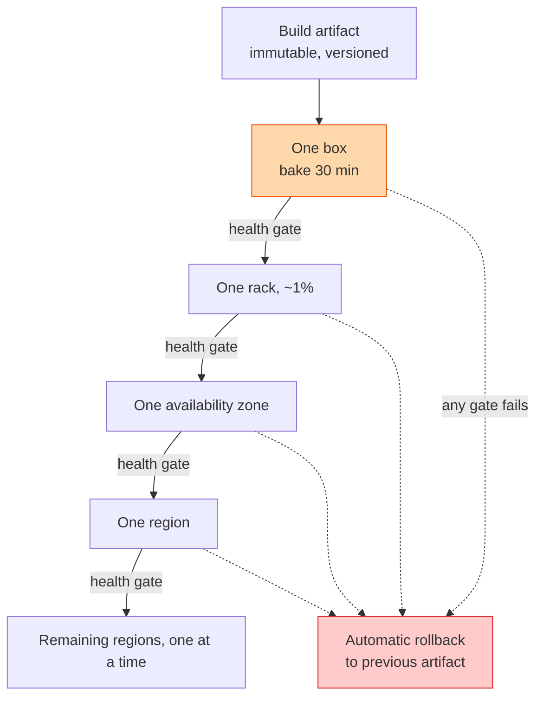

## The question

Design the system that takes a new build and puts it on a global fleet of ten thousand servers across many regions. A bad build must never reach all of them, and rolling back must be faster than rolling forward.

## Explain it to a ten-year-old

You baked a new recipe of cookies for the whole school. You do not hand out a thousand at once. You give one to your brother. He is fine. You give ten to your class. They are fine. You give a hundred to the year group. One child is sick. You stop, take the cookies back, and hand out yesterday's recipe instead. The order and the pause at each step are what keep everyone safe. That is a deployment pipeline.

## The trick

The pipeline is a series of gates, and each gate is a measurable health rule with a bake time. Error rate, latency, crash count, compared against the machines not yet upgraded. A gate that fails triggers rollback automatically. Humans watch; they do not decide. If a person must click to roll back at 3am, the design has already failed.

## The steps

1. **Artifacts.** Build once, sign it, give it a version. The same bytes go everywhere. Never build on the target.
2. **Waves.** One box, one percent, one zone, one region, the rest one region at a time. Never two regions at once, or the bad build takes out your redundancy.
3. **Bake time.** Wait at each wave long enough for slow failures to show. Memory leaks take an hour. A gate that passes in thirty seconds has tested nothing.
4. **Gates.** Compare the new wave to the old fleet, not to a fixed number. Error rate up, latency up, restarts up, any of them, and the pipeline stops and reverses.
5. **Rollback.** Keep the previous artifact on every box. Rollback is a symlink flip and a restart, seconds not minutes. Test rollback as often as you test deploy.
6. **Config and data.** A schema change or a config flag is a deployment too. Ship them through the same waves, and ship them separately from code, so you can roll one back without the other.
7. **Say the number.** Ten thousand boxes, ten percent per wave, an hour of bake, is a full day to reach everywhere. That is fine. Fast global deploys are how you get fast global outages.

## In GPU infrastructure

Firmware for GPUs, NICs and BMCs goes out across the fleet in exactly these rings: one host, one rack, one block, one region, then the rest one region at a time. The health gate at each ring is the burn-in and the health checks, comparing XID counts, NVLink errors and all-reduce bandwidth on the new ring against the untouched fleet. A bake of thirty minutes is not enough for firmware; some faults only show after the first long training job, so the ring holds for a day. Rollback keeps the previous firmware image on the host and reflashes on failure, and I test the reflash as often as the flash. A bad NIC firmware reaching every region at once is the outage nobody recovers from quickly.

## What I am listening for

- Whether rollback is automatic. If a human is in the loop I ask what happens when they are asleep.
- Whether you compare against the old fleet or a fixed threshold. Fixed thresholds fire at the wrong moments.
- Whether config changes go through the same pipeline. They cause more outages than code.


- **Waves with gates and bake time.** One box, one percent, one zone, one region.
- **Gates compare new to old**, and roll back on their own.
- **Rollback is seconds**, and it is tested.
- **Config is a deployment.** Same pipeline, separate from code.


## Go deeper

- Amazon's [Automating safe, hands-off deployments](https://aws.amazon.com/builders-library/automating-safe-hands-off-deployments/) is the best public description of this pattern. It is close to what I ran.
- The [Google SRE book](https://sre.google/sre-book/table-of-contents/) chapter on release engineering.

**With AI on the table.** The assistant draws a canary pipeline. I describe a build that passes every gate for six hours and then corrupts a cache on the seventh, after it has reached half the fleet. What does your system do now, and what would you change so it never gets that far again?
