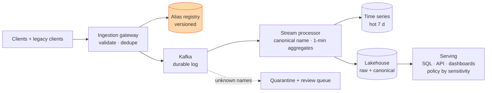

## The question

Design a system that ingests, processes and serves large-scale data to multiple stakeholders with varying needs and sensitivities. No machine learning knowledge required. Be ready to estimate the infrastructure for each part, and to say how the design handles failure and growth.

The concrete version: a telemetry system for a large fleet of clients reporting events continuously. And the follow-up that decides the round: legacy clients that cannot be upgraded emit inconsistent names for the same metric, `gpu_temp`, `GPUTemp`, `gpu.temperature`. How does the schema evolve while the data downstream stays usable?

## Explain it to a ten-year-old

Every house on the street posts its electricity reading through the letterbox of one office each hour. The office stamps each card, files it in a big cabinet, and writes the hourly totals on a board so the council can read them. Some old houses write "leccy" instead of "electricity". The office keeps a dictionary: leccy means electricity. When a card arrives with a word not in the dictionary, it goes in a tray for a human to decide, never in the bin and never guessed. Once the dictionary has the new word, someone goes back through the cabinet and fixes the old cards too.

## The trick

Two rules. First, **canonicalise at ingest, keep the raw**: every event gets a canonical metric id from a versioned alias table, and the raw name and mapping version travel with it. Second, **never guess a merge**: unknown names go to a quarantine topic and a review queue with volume counts, a human maps them, and a batch job re-maps history in the lake. Fuzzy matching or clustering feels clever and silently corrupts a metric; say that out loud before the interviewer asks.

## The steps

1. **Name the stakeholders and ask which matter.** Analytics wants hourly and daily aggregates. Product apps want low-latency derived metrics. Data science wants ad-hoc queries, sampling and backfills. Compliance wants row and column policies across public, internal, restricted and PII, with an audit trail.
2. **Numbers.** Events per second times bytes times retention gives ingest and storage; retention of seven days hot and one to three years cold; query concurrency of a hundred to a thousand; a cardinality budget per metric (labels times values) so one bad label does not blow up the index.
3. **Ingestion.** SDK buffers and samples, stamps an event id. A gateway authenticates, validates against the schema registry, dedupes on event id, and appends to a durable log (Kafka), partitioned by source. At-least-once everywhere; idempotent transforms downstream.
4. **Processing.** A stream processor canonicalises names, enriches with host and fleet metadata, and produces one-minute aggregates for alerting. Batch jobs do T+1 rollups, backfills and re-mapping after a registry change. Late and out-of-order events are handled with watermarks.
5. **Storage.** Time-series store for the hot week and alerting. Lakehouse (Iceberg on object storage) holding raw and canonical, partitioned by day and source, compacted, tiered to cold. Warehouse or OLAP for rollups behind dashboards.
6. **Serving and access.** SQL, APIs, pre-aggregations, exports. Workload isolation so an ad-hoc scan does not stall the on-call dashboard. A policy engine applies sensitivity tags carried from ingest: row and column filters by role, every access logged.
7. **The follow-up.** Registry with versioned alias entries and compatibility checks. Ingest maps alias to canonical id; unknown goes to quarantine, not the floor. Review queue shows unknown names with counts so an owner maps them. Batch re-maps history over the lake rather than rewriting rows in place. Correctness is measured: coverage percent of events with a canonical id, collision audits, dual-write comparison during a migration. Old names are deprecated by watching client-version adoption.
8. **Failure and growth.** Duplicates and replay: idempotent by event id, dead-letter for the rest. Bad data blast radius: quarantine plus versioned mapping plus re-run. Growth: partition by day and source, compaction, tiering, and a per-metric cardinality limit that pages someone when crossed.

## The board



## In GPU infrastructure

Fleet telemetry is exactly this. Tens of thousands of GPUs each emit hundreds of metrics a minute (temperature, power, XID errors, NVLink counters, RDMA retransmits) through agents that are upgraded a rack at a time, so three agent versions are always live and the metric names drift between them. A contract with one customer for streaming every GPU metric with under two minutes of delay is the latency requirement made concrete, and 1.2 billion metric streams a minute is the number that makes cardinality a design constraint rather than a footnote. The alias registry is also how you keep NVIDIA and AMD fleets in one dashboard: two vendors, one canonical id per physical quantity, raw names kept for the vendor's own tooling.

## What I am listening for

- Whether the pipeline is drawn end to end before the follow-up arrives, so the answer to the names question has a place to live.
- Canonicalise at ingest, keep the raw, version the mapping.
- Where unknown names go. "Dropped" is the wrong answer; "guessed" is worse.
- How history gets fixed, and how the candidate would know the mapping is right.
- Sensitivity tags carried from ingest, not bolted on at the dashboard.


- **Ingest → log → stream and batch → tiered storage → serve by role.**
- **Canonical id at ingest, raw name kept, mapping versioned.**
- **Unknown names: quarantine and review, never drop, never guess.**
- **Re-map history in the lake; measure coverage and collisions.**
- **Sensitivity is a tag on the event**, enforced at serving, audited.


## Go deeper

- [Apache Iceberg](https://iceberg.apache.org/docs/latest/) table format docs, for partitioning, compaction and schema evolution on object storage.
- [Confluent Schema Registry](https://docs.confluent.io/platform/current/schema-registry/index.html), the reference for versioned schemas with compatibility checks.
- [Monarch](https://research.google/pubs/monarch-googles-planet-scale-in-memory-time-series-database/), Google's planet-scale time-series database paper, for the hot-path side.
- [Design a Metrics Pipeline](/teach/systems/design-a-metrics-pipeline/) is the hot-path half of this lesson; [Design a Fleet Health Score](/teach/gpu-ai/design-a-fleet-health-score/) is what consumes it.

**With AI on the table.** The assistant will draw Kafka, Flink and Iceberg in one go and will happily suggest fuzzy matching for the names. I ask you what happens to the on-call dashboard the day `gpu_temp` and `gpu_temp_max` get merged by a similarity score. The tool knows the stack. You have to know what must never be automated.
