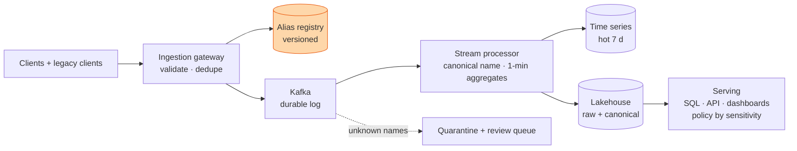

## The question

Design a system that ingests, processes and serves large-scale data to multiple stakeholders with varying needs and sensitivities. No machine learning knowledge required. Be ready to estimate the infrastructure for each part, and to say how the design handles failure and growth.

The concrete version: a telemetry system for a large fleet of clients reporting events continuously. And the follow-up that decides the round: legacy clients that cannot be upgraded emit inconsistent names for the same metric, `gpu_temp`, `GPUTemp`, `gpu.temperature`. How does the schema evolve while the data downstream stays usable?

## Explain it to a ten-year-old

Every house on the street posts its electricity reading through the letterbox of one office each hour. The office stamps each card, files it in a big cabinet, and writes the hourly totals on a board so the council can read them. Some old houses write "leccy" instead of "electricity". The office keeps a dictionary: leccy means electricity. When a card arrives with a word not in the dictionary, it goes in a tray for a human to decide, never in the bin and never guessed. Once the dictionary has the new word, someone goes back through the cabinet and fixes the old cards too.


```mermaid
flowchart LR
  c[Clients + legacy clients] --> ing[Ingestion gateway<br/>validate · dedupe]
  ing --> reg[(Alias registry<br/>versioned)]
  ing --> log[Kafka<br/>durable log]
  log --> sp[Stream processor<br/>canonical name · 1-min aggregates]
  log -. unknown names .-> q[Quarantine + review queue]
  sp --> ts[(Time series<br/>hot 7 d)]
  sp --> lake[(Lakehouse<br/>raw + canonical)]
  lake --> serve[Serving<br/>SQL · API · dashboards<br/>policy by sensitivity]
  style reg fill:#fed7aa,stroke:#ea580c
```

## The trick

Two rules. First, **canonicalise at ingest, keep the raw**: every event gets a canonical metric id from a versioned alias table, and the raw name and mapping version travel with it. Second, **never guess a merge**: unknown names go to a quarantine topic and a review queue with volume counts, a human maps them, and a batch job re-maps history in the lake. Fuzzy matching or clustering feels clever and silently corrupts a metric; say that out loud before the interviewer asks.

## The steps

1. **Name the stakeholders and ask which matter.** Analytics wants hourly and daily aggregates. Product apps want low-latency derived metrics. Data science wants ad-hoc queries, sampling and backfills. Compliance wants row and column policies across public, internal, restricted and PII, with an audit trail.
2. **Numbers.** Events per second times bytes times retention gives ingest and storage; retention of seven days hot and one to three years cold; query concurrency of a hundred to a thousand; a cardinality budget per metric (labels times values) so one bad label does not blow up the index.
3. **Ingestion.** SDK buffers and samples, stamps an event id. A gateway authenticates, validates against the schema registry, dedupes on event id, and appends to a durable log (Kafka), partitioned by source. At-least-once everywhere; idempotent transforms downstream.
4. **Processing.** A stream processor canonicalises names, enriches with host and fleet metadata, and produces one-minute aggregates for alerting. Batch jobs do T+1 rollups, backfills and re-mapping after a registry change. Late and out-of-order events are handled with watermarks.
5. **Storage.** Time-series store for the hot week and alerting. Lakehouse (Iceberg on object storage) holding raw and canonical, partitioned by day and source, compacted, tiered to cold. Warehouse or OLAP for rollups behind dashboards.
6. **Serving and access.** SQL, APIs, pre-aggregations, exports. Workload isolation so an ad-hoc scan does not stall the on-call dashboard. A policy engine applies sensitivity tags carried from ingest: row and column filters by role, every access logged.
7. **The follow-up.** Registry with versioned alias entries and compatibility checks. Ingest maps alias to canonical id; unknown goes to quarantine, not the floor. Review queue shows unknown names with counts so an owner maps them. Batch re-maps history over the lake rather than rewriting rows in place. Correctness is measured: coverage percent of events with a canonical id, collision audits, dual-write comparison during a migration. Old names are deprecated by watching client-version adoption.
8. **Failure and growth.** Duplicates and replay: idempotent by event id, dead-letter for the rest. Bad data blast radius: quarantine plus versioned mapping plus re-run. Growth: partition by day and source, compaction, tiering, and a per-metric cardinality limit that pages someone when crossed.

## The board



### The mock version: 100k clients, a million events a second, and the names follow-up

Run as a timed mock, the question arrives smaller than the platform blurb above and the follow-up arrives sooner. A hundred thousand clients, a million events a second, engineers querying and alerting, ingestion that never blocks, queryable within a minute, raw kept. Three things decide the round.

1. **The CAP sentence, in one breath.** Recording an event is a deposit, not a withdrawal: nothing waits on a previous write, so a queue sits in front of the store and every event is accepted now. If you need a queue, you are choosing availability. Explaining availability as "the client retries" reads as consistency and costs ten minutes.
2. **Three consumers on one log.** The ingestion service is the batching; it appends to Kafka and acknowledges only after the append, because a crash between receive and append is the batching window. Behind Kafka the raw writer, the rollup and the alert evaluator each read the same log at their own pace. Rollups are per series, not per event: a hundred thousand clients times a hundred metrics is ten million series, and that number, not the million events a second, is what the rollup holds in memory.
3. **Do not erase the normaliser.** When the interviewer asks what a box means, explain it; it is the answer to the follow-up. Old clients send `send`, new ones `send_content`. Part one: resolve the name at ingest through the versioned alias registry, keep the raw name on the record, quarantine unknowns. Part two: replay raw from the lake through the mapping into canonical partitions, rewrite the rollups, and expand the alias at query time until the backfill is done so the user sees one series and no gap.



[Download the two-sided cheat sheet](/teach/systems/telemetry-names-cheat-sheet.pdf) (A4: front is the five-sentence opener, the numbers, the entities, the two endpoints and the two-part follow-up; back is the board above).

## When the problem keeps changing: duplicates, renamed metrics, and a bad mapping

A harder version of this question starts small and then changes the rules three times. First a simple design, end to end. Then a client retry. Then old clients that send a different name for what looks like the same metric. Then the news that yesterday's fix merged two metrics that were never the same. Each change lands on a different part of one pipeline, so draw the pipeline first and keep it on the board.

The setting: request-duration telemetry from many tenants' applications. 100,000 observations a second, bursts of 5×, queryable within a minute, observations up to 24 hours late, raw kept 30 days and aggregates 90.



### Trace one observation end to end

Write one observation down before drawing boxes.

```json
{ "event_id": "7f3c…e1", "tenant": "acme", "app": "checkout", "client_version": "2.3.1",
  "metric": "request_duration_ms", "value": 182, "event_time": "2026-10-03T16:05:12.345Z" }
```

Then follow it, one hop per sentence.

1. **SDK.** Buffers observations and sends a batch every second or every 500 observations. The client creates the `event_id`, so a retry carries the same id.
2. **Ingest gateway.** Authenticates the tenant, validates the schema and size, checks the tenant's quota and stamps `arrival_time`.
3. **Durable log.** Kafka, partitioned by tenant and app, replicated with `acks=all`. The gateway returns 202 with the accepted ids only after the replicated append, so an acknowledged observation survives one node failure.
4. **Stream processor.** Dedupes on `event_id` in keyed state kept for more than 24 hours. Resolves the metric definition and unit. Adds the value to the minute bucket of its event time, not its arrival time: count, sum, min, max and a mergeable histogram sketch.
5. **Aggregate store.** Upserts the row `(tenant, app, client_version, metric, minute)`. A late observation updates an old minute, so the dashboard says the last 24 hours may still change.
6. **Raw table.** A raw writer copies every observation, with its original fields, to a columnar table partitioned by tenant and day. This table is what makes every later fix possible.
7. **Query.** "p99 and mean request duration for `checkout`, by client version, last hour, per minute" reads 60 rows per version. The mean is Σsum / Σcount. The p99 comes from the merged sketches.

The numbers: 100,000 × 200 bytes is 20 MB/s. 100,000 × 86,400 is 8.6 billion observations a day, about 1.7 TB raw. Dedupe state for 24 hours of 16-byte ids is about 140 GB, spread across the partitions.

If someone asks why a box is there, answer in two sentences: what it does, and why this design needs it. If you cannot, drop the box. A priority queue with no priority requirement is a plain durable log plus per-tenant quotas.

### The retry after a lost ack

The gateway appended the batch, but the 202 never reached the client. The client resends the same batch with the same event ids. The log now holds it twice. That is at-least-once delivery, and it is all a queue gives you. The processor's dedupe on `event_id` drops the second copy, and the raw table dedupes on the same id, so the dashboard counts each observation once.

Exactly-once here comes from two things together: an id made on the client that survives the retry, and dedupe state that lives longer than the late window. Adding a queue gives you neither. Some products can accept a bounded, documented duplicate rate instead. That is a fine answer if the product owner agrees to it.

### The renamed metric

Older clients that cannot be updated send a different name for what appears to be the same metric. Engineers want one continuous chart.

**Ask how they differ before designing anything.** Same request boundaries? Same unit? Who confirmed it? The answer usually holds the real problem. Say v1 sends `request_latency` and v2 sends `request_duration_ms`: same boundaries, both milliseconds, confirmed by the owners. Another application's `request_latency` is in seconds and measures a wider span. Or v1 covers services A, B and C while v2 covers only A and B, so a blind merge pours service C into the v2 chart.

**Spelling is not evidence.** Merge only when the owners confirm the same measurement. Convert units only after that. Unknown names stay separate and marked unmapped.

**Scope the alias.** The mapping is a versioned table keyed by tenant, app, client version and raw name. It returns the canonical metric id, the unit conversion, the mapping version and who approved it. A global string replace is wrong, because the same name means different things in different apps. In the A, B, C case, map v1 only if it carries the service label, and filter it to A and B. Otherwise keep v1 as its own series and mark the boundary on the chart.

**Incoming data and history are two problems.** Incoming data is the easy one. The processor resolves the name at ingest, converts the unit, writes the canonical id, and keeps the original name, client version and mapping version on the record. History has two coherent answers.

| Option | How | What you must explain |
|---|---|---|
| Read-time alias | The query expands the canonical metric to its scoped raw series and converts units | Query cost, mapping versions, only mergeable aggregates combine |
| Rebuild | Replay 30 days of raw through the mapping into a new aggregate generation, shadow-compare, switch queries | Raw retention: aggregates older than 30 days cannot be rebuilt |

Use both, in sequence. The read-time alias gives one chart on day one. The rebuild runs in the background, then queries cut over. Days 31 to 90 can be relabelled only if those aggregates kept their original names. If they did not, say they cannot be merged.

**Merge aggregates correctly.** The mean is Σsum / Σcount. An average of averages is wrong whenever the counts differ. Percentiles do not merge from percentile values. Keep a mergeable sketch per bucket (DDSketch, t-digest or an HDR histogram) and merge the sketches.

### The bad mapping

Yesterday's mapping combined two metrics that were different. Dashboards and aggregates are now mixed. Seven days of raw observations are available, and ingestion cannot stop.

1. **Stop the damage.** Publish mapping version n+1 that separates the two. Each partition records the log offset T where it switched. From T on, live processing uses n+1.
2. **Scope it.** List the affected keys (tenant, app, client version, raw name), the time range from when mapping n went live until T, and every table and dashboard that reads them. Put a "being corrected" banner on those dashboards.
3. **Rebuild from raw into a new generation.** Raw kept the original name, app and version, so the two metrics can still be told apart. Replay raw for the affected keys and range into aggregate generation g+1. Leave generation g untouched.
4. **Count each event once.** The offset T per partition is the boundary. Records before T are rebuilt from raw. Records at or after T go through live processing with n+1 and write into g+1. Each record lands on exactly one side, and both sides upsert keyed by event id. A late observation with an old event time that arrives after T takes the live path with the new mapping, so it is counted once too.
5. **Validate, then flip.** Per key, compare counts and sums in g+1 with counts from raw. Check units. Run a few representative queries against g and g+1 side by side. Then move the query pointer to g+1 in one atomic step, and keep g for rollback.
6. **Say what cannot be recovered.** If any table stored only merged aggregates without the original names, those minutes cannot be separated. Mark them on the chart. Do not invent a recovery.

### How to notice a bad mapping

The biggest risk left is another wrong mapping that silently merges two different metrics. Three checks catch it.

- **Before activating a mapping,** compare the two raw series' distributions: magnitude, p50 and p99. Milliseconds against seconds shows up as a factor of a thousand.
- **After activating,** alarm automatically on a step change in the canonical series at the exact start time of the mapping version.
- **Before any cutover,** run shadow queries that compare the old and new mapping on the same raw data.

Owner approval and an audit log of who changed which mapping make the failure traceable when it happens anyway.

The thread through all three changes is the same three pieces: an id made on the client, raw kept with its original names, and versioned mappings and generations. With those in place, every change to the problem becomes a replay.

## In GPU infrastructure

Fleet telemetry is exactly this. Tens of thousands of GPUs each emit hundreds of metrics a minute (temperature, power, XID errors, NVLink counters, RDMA retransmits) through agents that are upgraded a rack at a time, so three agent versions are always live and the metric names drift between them. A contract with one customer for streaming every GPU metric with under two minutes of delay is the latency requirement made concrete, and 1.2 billion metric streams a minute is the number that makes cardinality a design constraint rather than a footnote. The alias registry is also how you keep NVIDIA and AMD fleets in one dashboard: two vendors, one canonical id per physical quantity, raw names kept for the vendor's own tooling.

## What I am listening for

- Whether the pipeline is drawn end to end before the follow-up arrives, so the answer to the names question has a place to live.
- Canonicalise at ingest, keep the raw, version the mapping.
- Where unknown names go. "Dropped" is the wrong answer; "guessed" is worse.
- How history gets fixed, and how the candidate would know the mapping is right.
- Sensitivity tags carried from ingest, not bolted on at the dashboard.


- **Ingest → log → stream and batch → tiered storage → serve by role.**
- **Canonical id at ingest, raw name kept, mapping versioned.**
- **Unknown names: quarantine and review, never drop, never guess.**
- **Re-map history in the lake; measure coverage and collisions.**
- **Sensitivity is a tag on the event**, enforced at serving, audited.


## Go deeper

- [Apache Iceberg](https://iceberg.apache.org/docs/latest/) table format docs, for partitioning, compaction and schema evolution on object storage.
- [Confluent Schema Registry](https://docs.confluent.io/platform/current/schema-registry/index.html), the reference for versioned schemas with compatibility checks.
- [Monarch](https://research.google/pubs/monarch-googles-planet-scale-in-memory-time-series-database/), Google's planet-scale time-series database paper, for the hot-path side.
- [Design a Metrics Pipeline](/teach/systems/design-a-metrics-pipeline/) is the hot-path half of this lesson; [Design a Fleet Health Score](/teach/gpu-ai/design-a-fleet-health-score/) is what consumes it.

**With AI on the table.** The assistant will draw Kafka, Flink and Iceberg in one go and will happily suggest fuzzy matching for the names. I ask you what happens to the on-call dashboard the day `gpu_temp` and `gpu_temp_max` get merged by a similarity score. The tool knows the stack. You have to know what must never be automated.
