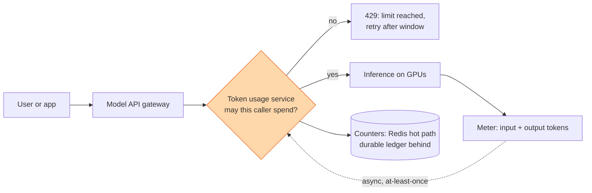
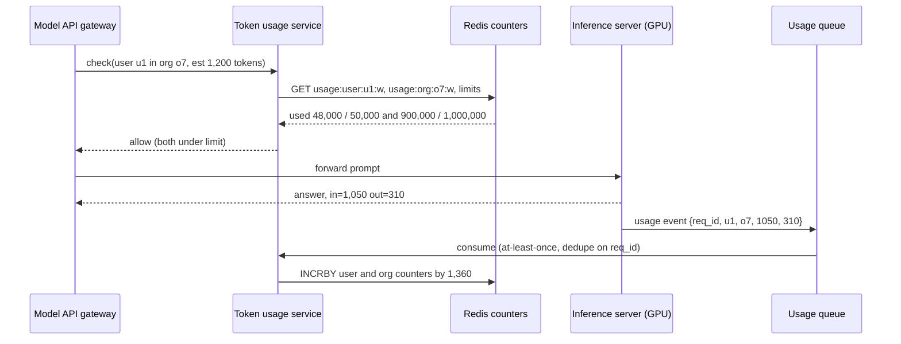

## The question

Design an internal token usage API that lets teams check and update limits and usage across personal and organisation accounts.

That is the whole prompt. Everything else you have to ask for. In the version I rehearsed, the interviewer added two constraints once I asked: every model request passes through this system, so it must be as fast and as available as anything in the stack, and we are only building the enforcement software, not a billing product or a dashboard.

The shape is one you will meet in every AI company and in every cloud: a [rate limiter](/teach/systems/design-a-rate-limiter/) whose unit is tokens instead of requests, sitting on top of a [quota system](/teach/systems/design-a-quota-system/) with two levels, person and organisation.

## Explain it to a ten-year-old

A swimming pool sells wristbands. A kid's wristband is good for a hundred minutes a week. A school buys one big band for the whole class, a thousand minutes shared, and the teacher can say "no child more than eighty". At the gate, the lifeguard looks at your band and answers one question in a second: in or not. While you swim, a clock on the wall counts your minutes. When you climb out, the clock writes the minutes on your band and on the school's band. The lifeguard never makes you wait while the clock is being written. If the clock breaks, the lifeguard lets you in and someone fixes the numbers later, because an empty pool costs more than a few free minutes.



## The trick

Two counters per account, not one number. A **limit** (what you may spend in the window) and **used** (what you have spent). The check is one read and one compare. The record is one atomic increment, done after the GPU has answered, never before. And the system is built so that if the check is slow or the store is down, the request goes through and the miss is reconciled later. A token gate that blocks the model by accident is worse than one that lets a few thousand tokens through for free. Say that in the first ten minutes and the interviewer relaxes.

## The steps

This round is not about scale. Requests per second are whatever the model API does, tens of thousands, and every one of them touches this service, but each touch is a hash lookup. The round is about getting the requirements, the entities and the API right, then defending two or three decisions. Budget the 55 minutes: ten on requirements, ten on entities and API, fifteen on the picture, the rest on what breaks.

1. **Ask the questions that change the design.** Who is the caller: a human with a personal email, or an employee under a company account? Can one person be both? What is the window: rolling five hours like Claude's consumer plans, per minute like the API, per month like a bill? Is the limit in tokens, in dollars, or both? Do input and output tokens count the same? Is there a hard cap or a soft warning first? And the one I forgot: where do the token counts come from, the gateway or the model server? Every one of these turns into a field or an endpoint later. Ask them now, not at minute forty.

2. **Write the functional requirements as sentences.** A caller can ask "may this account spend N more tokens?" and get yes or no in single-digit milliseconds. An admin can set a limit for a person or for an organisation. An organisation admin can set per-member limits inside the organisation's limit. The system records tokens actually used after each request. Personal accounts are keyed by email; organisation accounts by organisation id with members inside.

3. **Write the non-functional ones with numbers.** Check latency under 5 ms at P99, because it sits in front of every request. Availability above the model API's own, five nines is the honest target. **Availability over consistency.** If two requests race on the last thousand tokens, both may pass; the user gets a few tokens free and the counter catches up. Compare that with a bank: a bank waits so it never sends the same five hundred dollars twice. We are not a bank. Nobody loses money if one request slips through, and everybody loses if the gate is down. This decision is a non-functional requirement, and it drives the storage choice two steps later.

4. **Name the entities.** Five is enough.
   - **User**: id, email.
   - **Organisation**: id, name.
   - **Membership**: user id, organisation id, role. A personal account is a user with no membership.
   - **Limit**: scope (user or organisation), scope id, window type (rolling 5 h, per minute, monthly), max tokens, optional max dollars, set by, set at.
   - **Usage**: scope, scope id, window start, tokens in, tokens out, dollars. One row per scope per window.

   The hierarchy is the interesting part. An organisation has a limit. Its members each have a limit too, and the sum of member limits is usually larger than the organisation's, because a company with twenty engineers and a thousand-dollar cap will happily give each engineer a hundred, betting that not everyone maxes out. So a check for an employee is two checks: the member's own counter, then the organisation's counter, and both must pass.

5. **Write the API. Three endpoints.**
   - `GET /usage?scope=user|org&id=…` returns limit, used, window start, window end, remaining.
   - `PUT /limits` sets a limit for a scope. Organisation admins may only set limits inside their organisation and under its cap.
   - `POST /usage/check` with the estimated tokens for this request; answers allow or deny with retry-after.
   - `POST /usage/record` with the actual input and output tokens once the model has answered, plus the request id so a retry does not double count.

   The last one is the endpoint I missed in the mock. Checking without recording is a gate with no clock. The coach's line was: "you would also need some API to handle recording token usage".

6. **Draw the picture around the model call.** Client sends a prompt to the model API gateway. The gateway asks the usage service "may this caller spend roughly N tokens?", where N is the input length plus a guess at the output. Yes: forward to the inference pool. No: return 429 with the window end time. When the GPU finishes, the inference server, which is the only place that knows the exact input and output token counts, emits a usage event. A small reporting agent next to the model server (not an AI agent, a piece of software) sends that event to the usage service, which increments the counters. The check is synchronous and tiny; the record is asynchronous and durable.

7. **Choose storage for the hot path.** Counters live in Redis, one key per scope per window: `usage:{scope}:{id}:{window_start}`, value is tokens used, with a TTL a little longer than the window. Limits are read far less often than usage, so cache them in the same place with a longer TTL, source of truth in Postgres. A single Redis node does over a hundred thousand operations a second; shard by scope id with [consistent hashing](/teach/systems/consistent-hashing/) when you outgrow one. The increment is `INCRBY`, atomic on its own; check-and-increment together is a five-line Lua script if you want the tighter version.

8. **Make the record path at-least-once.** Usage events go on a queue (Kafka or a Redis stream) before they hit the counters, so a burst of model responses does not stall the model servers. Events carry the request id; the consumer keeps a short dedupe set so a replay does not double count. Behind the counters, an append-only ledger in Postgres or a warehouse records every event for billing and for the nightly reconcile.

9. **Windows.** A rolling five-hour window is what consumer plans use: the window starts at the first request and ends five hours later, then a new one starts. Implement it as a fixed bucket keyed by window start, which is cheap and good enough; a true sliding window needs a sorted set per account and is only worth it for per-minute API limits. Say which you chose and why.

10. **Fail open, on purpose.** If Redis times out, the check returns allow and logs a miss. If the queue backs up, the model keeps serving and usage is late, not lost. The one exception is a hard organisation cap that the customer has asked to be enforced strictly; for that scope, fail closed and say so in the contract. The coach's closing note: "make sure the token usage service never blocks the model unless you intend to block it".

11. **Reconcile.** A nightly job sums the ledger per scope per window and compares it with the counters. Drift is expected (fail-open misses, replayed events); fix the counters, alert on the size of the drift, and feed the ledger, never the counters, to billing.

This is what the board should look like at minute forty, and it is the single most useful thing on this page.



Scroll and zoom inside the frame, or open it full screen. The right half is the system diagram: clients at the top, the gateway, the usage service with its counters and the source-of-truth database beside it, the GPU pool below, then the asynchronous meter path along the bottom (reporter, topic, consumer, ledger, reconcile). Solid arrows are the synchronous request, numbered one to five; dashed arrows are the asynchronous record, six to ten. Colour marks the layer. The left half is the doc: requirements, entities, API, and "what breaks first", each short enough to type in the first fifteen minutes. Put it next to the first draft linked further down and the difference is the lesson.

Here is the check running against both levels for an employee, then the record arriving late:



## The template

The shape is **a synchronous gate in front of an asynchronous meter**. Payments authorisation, cloud quota, and API rate limits all have the same loop.

```text
check(scope_chain, estimate):          # scope_chain = [user, org] or [user]
    for scope in scope_chain:
        limit = LIMITS.get(scope) or DEFAULT
        used  = COUNTERS.get(scope, window_now())   # Redis GET, or 0
        if used + estimate > limit.max:
            return DENY(retry_after = window_end(scope))
    return ALLOW                                     # on any store error: ALLOW, log miss

record(event):                          # consumed from the usage queue
    if SEEN.contains(event.req_id): return           # dedupe, short TTL
    for scope in event.scope_chain:
        COUNTERS.incrby(scope, window_now(), event.tokens_in + event.tokens_out)
    LEDGER.append(event)                             # durable, feeds billing + reconcile
    SEEN.add(event.req_id)

set_limit(actor, scope, max):
    require actor.can_admin(scope)
    if scope is a member: require max <= LIMITS[org].max
    LIMITS.put(scope, max, by=actor)

nightly reconcile():
    for scope, window in LEDGER.sums(): COUNTERS.set_if_drift(scope, window, sum); alert on |drift|
```

What changes per problem is the window function, the scope chain, and whether a scope fails open or closed. What must be understood is why the check reads two counters and the record writes two, and why the ledger, not the counter, is what you bill from.

## In GPU infrastructure

Tokens are the unit because GPU time is the cost. An output token costs many times an input token, because every output token is one more forward pass through the model, while input tokens are processed in one batch. So the record event carries input and output separately and the limit may weight them differently. The only component that knows the true counts is the inference server after decoding finishes, which is why the meter lives beside the GPU and not at the gateway. And the reason the gate sits before the GPU at all: a denied request that never reaches the pool frees a slot in the [batcher](/teach/gpu-ai/design-an-inference-api/) for someone who is under their limit. Cached prompt tokens often do not count toward limits on real APIs, which is a nice follow-up: the event carries a cached-tokens field and the check subtracts it.

## What I am listening for

- Whether the record endpoint exists. Most candidates design the check and forget the clock.
- Whether the organisation and the member are two counters checked together, and whether the candidate notices members can be over-allocated on purpose.
- Whether the candidate says "fail open" unprompted and names the one scope that should not.
- Whether the window type was asked about before the data model was drawn.
- Whether the estimate for the check is explained. You do not know the output length before generation; you guess, then true it up on record.

## What I got wrong in the mock

I keep this section because the mistakes are the lesson.

- I spent the first fifteen minutes on capacity questions and billing models. The coach cut it short: "we are not designing the whole product, we are designing the software that says yes or no and counts". Ask about scale in one sentence, then move on.
- I wrote functional requirements as a list of features rather than sentences a user can do. Sentences force you to find the missing verb, and the missing verb here was "record".
- I put "availability over consistency" under functional requirements. It is a non-functional decision, and it is the one that justifies Redis counters and fail-open later. Put it where it does work.
- I drew arrows between tables. The coach: "no need to draw arrows yet, just say what the link is". A user id column is the link. Save the arrows for the request flow.
- I started to write pseudocode. Not in this round. Endpoints and a flow, then depth.
- I did not ask whether the limit was per month, per day or rolling. When it surfaced at minute 48, it should have been minute 3.
- The first draft of the picture had the GPU and the usage service side by side with no arrow between them. The fix was the reporting agent beside the inference server, and the gate in front of it. The raw whiteboard from that session is [here, read-only, on Excalidraw](https://link.excalidraw.com/readonly/BfWm9in1hOAlt6NgiOrX) if you want to see the before ([source file](/teach/systems/token-usage-first-draft.excalidraw)), and the [corrected board](https://link.excalidraw.com/readonly/QbajEzNXfQO72ST5g3Jq) is the after.

The coach's summary of what the real round looks like: functional requirements, non-functional requirements, data model, API, in whichever order is clearest to you, then the diagram, then the technical challenges. "This is not nearly enough diagram" was the verdict on mine. The challenges are where the time should go.


- **Two counters per scope: limit and used.** Check reads, record increments, ledger remembers.
- **Employee = two checks**, member and organisation, and members are over-allocated on purpose.
- **Check before the GPU, record after it.** The meter lives next to the model server.
- **Fail open** unless a scope is contractually hard, and reconcile nightly from the ledger.
- **Ask about the window** (rolling 5 h, per minute, monthly) before drawing anything.
- **Availability over consistency**, and say why: we are not a bank.


## Go deeper

- [Claude Platform rate limits](https://platform.claude.com/docs/en/api/rate-limits): token bucket, three dimensions (requests, input tokens, output tokens per minute), organisation tiers, per-workspace limits under an organisation-wide cap, and cached input tokens not counting. This is the production version of this lesson.
- [Claude usage limit best practices](https://support.claude.com/en/articles/9797557-usage-limit-best-practices): the rolling five-hour session window plus a weekly cap, shared across web, desktop and Claude Code. The consumer version of the window question.
- [Hello Interview: distributed rate limiter](https://www.hellointerview.com/learn/system-design/problem-breakdowns/distributed-rate-limiter) and their [video walkthrough](https://www.youtube.com/watch?v=YXkOdWBwqaA), the most thorough public treatment of token bucket against sliding window and where the counters live.
- [Redis: build five rate limiters](https://redis.io/tutorials/howtos/ratelimiting/), fixed window, sliding window and the Lua script that makes check-and-increment atomic.
- Alex Xu, *System Design Interview*, chapter 4 (rate limiter). The chapter this question is a costume of.
- [Design a Rate Limiter](/teach/systems/design-a-rate-limiter/), [Design a Quota and Capacity System](/teach/systems/design-a-quota-system/) and [Design an Inference API](/teach/gpu-ai/design-an-inference-api/) are the three lessons here this one stands on.

**With AI on the table.** An assistant will draw the gateway, Redis and a queue in one go. So I ask it for the check with a single counter, then ask you why that is wrong for an employee, and what the organisation admin sees when twenty members each have a hundred-dollar limit under a thousand-dollar cap. The tool knows the loop. You have to know the second counter.
