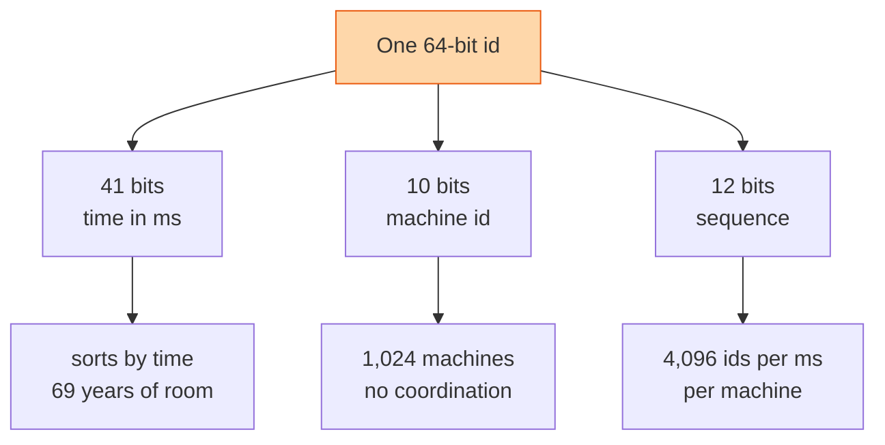

## The question

Design a service that gives every new order, message or event a unique 64-bit id. Thousands of machines, millions of ids a second, ids should sort by time, and no central server on the hot path.

## Explain it to a ten-year-old

Every child in a big school gets a ticket number when they walk in. If one teacher hands out all the tickets, there is a queue at the gate. Instead, each gate has its own teacher and its own coloured tickets. The number on the ticket is the time you arrived, then the gate you came through, then how many children came through that gate in that second. Two children can never get the same ticket, and if you sort tickets you get arrival order. No teacher ever has to ask another teacher anything.

## The trick

Pack three things into one number: when, where, and a counter. Time in the high bits gives you sort order. Machine id in the middle gives uniqueness without coordination. A counter in the low bits handles many ids in the same millisecond. Twitter called this Snowflake. Every company has a copy.

## The steps

1. **Why not a database sequence.** One row, one lock, one machine. Fine at a thousand a second, dead at a million. And it is a single point of failure on the write path of everything.
2. **Why not a random UUID.** Unique, yes. Sorted by time, no. Random keys scatter writes across an index and make databases slow. And 128 bits is twice the storage.
3. **Layout.** One sign bit, 41 bits of milliseconds, 10 bits of machine id, 12 bits of sequence. Say the number: 4,096 ids per millisecond per machine, 1,024 machines, for 69 years.
4. **Machine id.** Assigned once at startup from a small registry or from the host's position in the fleet. Two machines with the same id is the one way this design produces duplicates.
5. **Clock goes backwards.** NTP adjusts the clock and time steps back by 50 milliseconds. The generator would now reuse timestamps. Refuse to issue ids until the clock catches up, and alert. Never issue a smaller timestamp than the last one you issued.
6. **Sequence overflow.** More than 4,096 ids in a millisecond on one machine. Spin until the next millisecond. It costs a microsecond and it is rare.

## What I am listening for

- Whether you say "clock" before I do. Time is the only shared thing in the design and it is the only thing that lies.
- Whether you know why random ids hurt a database index.
- What happens when two machines get the same machine id. The answer is duplicates, and the fix is the registry.


- **Timestamp, machine id, sequence. 41, 10, 12 bits.**
- **Sorts by time, unique without talking.**
- **Clock moves backwards: stop and wait.** Never reissue a timestamp.
- **Machine id must be unique**, and that is the one central piece.


**With AI on the table.** The assistant will produce Snowflake from memory. I ask what you do when the fleet grows past 1,024 machines, and whether you would rather steal bits from the timestamp or the sequence. Show me the trade with numbers.
