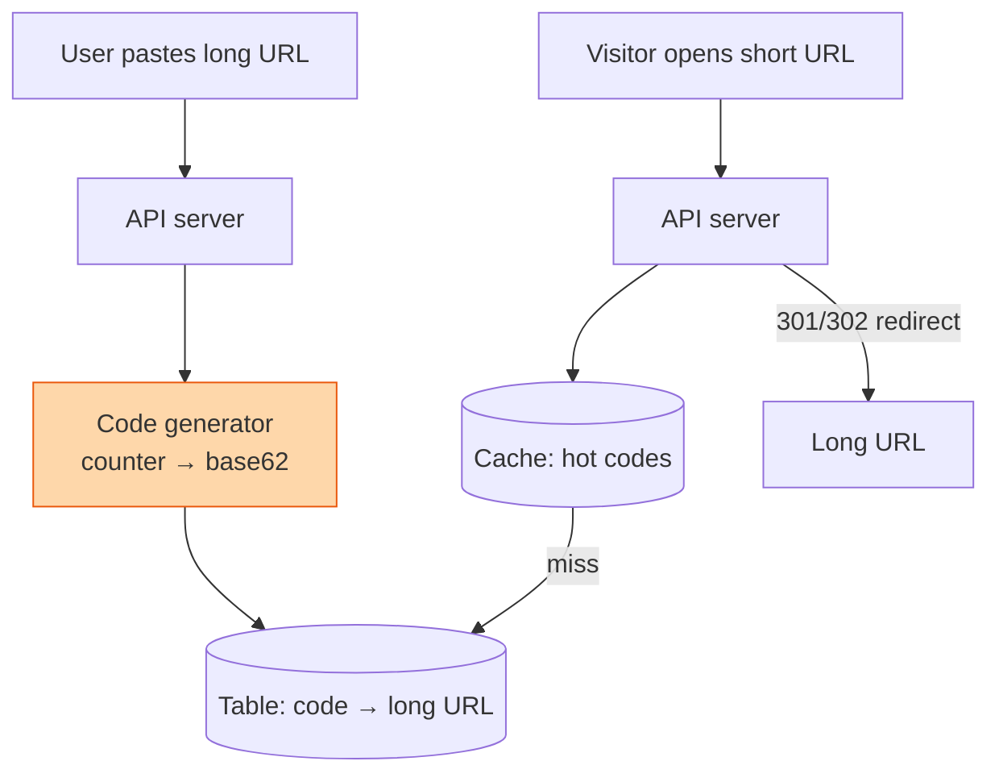

## The question

Design a service like bit.ly. Give it a long URL, get a short one back. Anyone who visits the short one is sent to the long one. Hundreds of millions of links, billions of visits.

## Explain it to a ten-year-old

A library has thousands of books with long titles. Instead of writing the whole title on your reading list, the librarian gives each book a small sticker with a code, like B7K2. You write down B7K2. When you come back and say "B7K2", the librarian looks it up in the big register and hands you the right book. The register is the database. The sticker is the short code. The only hard part is making sure no two books ever get the same sticker.

## The trick

Do not hash the URL and hope. Take a number from a counter and write it in base 62, the digits plus upper and lower case letters. Seven characters gives you 62 to the power 7, which is about 3.5 trillion codes. A counter never collides. The only thing left to worry about is handing out counter ranges to many servers so they do not fight over one number.

## The steps

1. **Say the number.** 100 million new links a year is about 3 per second. Reads are maybe 100 times that. This is a read-heavy system with a tiny write load. Design for the reads.
2. **Code generation.** A central counter is a bottleneck and a single point of failure. Give each API server a block of a million numbers at a time from a small ticket service. It goes back for more when it runs out. If a server dies, its unused block is wasted. Nobody cares.
3. **Storage.** One table, code to long URL, plus created time and owner. Key-value store or a relational table, both fine. Shard by code once it outgrows one box.
4. **Redirect.** A 301 is permanent and browsers cache it, which is cheap but you lose the click count. A 302 sends every visit through you. Pick based on whether the customer wants analytics.
5. **Cache.** A small fraction of links get most of the clicks. Keep them in memory in front of the database. Cache misses go to the database; cache hits never touch it.
6. **Abuse.** Rate limit link creation per user. Keep a blocklist of bad destinations. Short links are a favourite tool of people you do not want as customers.

## What I am listening for

- Whether you reach for a hash of the URL. I then ask what you do on a collision, and the counter answer usually appears within a minute.
- Whether you say 301 or 302 and know the difference. It is a small thing that tells me you have shipped a web service.
- Whether you ask if links expire. It changes the storage story completely.


- **Counter plus base 62.** No collisions, seven characters, trillions of codes.
- **Hand out counter blocks**, not single numbers.
- **Read heavy.** Cache the hot links, shard the rest.
- **301 caches, 302 counts.** Ask which the customer wants.


## Go deeper

- [ByteByteGo](https://bytebytego.com/) has the canonical walk-through of this one. Read it after you have tried it yourself.
- [Consistent hashing](https://en.wikipedia.org/wiki/Consistent_hashing) is the next thing to learn once you shard the table.

**With AI on the table.** The assistant gets this right in one go. So I ask what happens when the ticket service that hands out counter blocks is down for an hour. Can you still create links? Should you? The template has no opinion, and you must.
