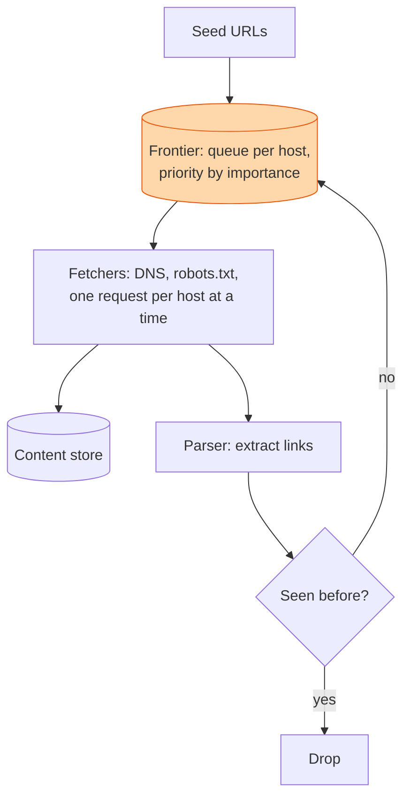

## The question

Design a crawler that fetches billions of web pages, follows their links, stores the content, and revisits pages as they change. It must not overload any one site.

## Explain it to a ten-year-old

You want to visit every house in a town. You start at your own, write down every house your neighbours mention, and go to those. Every time you enter a house you note down the ones it mentions. Two rules keep you sane. You keep a list of houses already visited so you do not knock twice. And you never knock on the same street ten times a minute, because the people there would get cross. That list is the frontier. The visited list is the seen-set. The street rule is politeness.

## The trick

It is breadth-first search where the queue is too big for memory and the graph is owned by strangers. So the frontier lives on disk, sharded by host, so that one fetcher owns each host and can pace it. The seen-set is a Bloom filter, tiny and fast, with an occasional false "seen" that costs you a page and nothing else.

## The steps

1. **Say the number.** A billion pages a month is about four hundred a second. Each is a hundred kilobytes, so forty megabytes a second and a hundred terabytes a month of raw content. A few hundred fetchers is plenty.
2. **Frontier.** Two levels. A priority queue that decides what is worth fetching next, by how important and how often-changing the page is. Then per-host queues that enforce one connection per host and a delay between requests.
3. **Politeness.** Read robots.txt first and obey it. One request per host at a time. Back off when a host returns errors. This is not optional; it is the difference between a crawler and an attack.
4. **Fetching.** Resolve DNS once and cache it. Time out fast. Store the raw bytes with a checksum so an identical page seen at a new URL is detected and skipped.
5. **Parsing.** Extract links, normalise them, lower-case the host, strip fragments. Check the seen-set. New ones go to the frontier with a priority.
6. **Traps.** Calendars that link to next month forever. Session ids in URLs. Cap depth per host and cap URL length, or one site eats your whole crawler.
7. **Revisit.** Pages change. Track when each one last changed and revisit at a rate that matches. News every hour, a company's about page every month.

## In GPU infrastructure

The topology inventory is a crawl. Start from the switch list, ask each switch for its neighbours over LLDP, ask each node for its NICs and its NVLink layout, and follow every link until nothing new appears. The seen-set is what keeps you from walking the same spine switch a hundred times, and politeness is per rack, one query per switch at a time, because a management plane that gets forty thousand SNMP calls in a minute falls over and takes the dashboards with it. The traps are real too: a mis-cabled loop or a NIC that reports a different MAC each poll will grow the frontier forever unless you cap it. Revisit rate matters, since a rack changes after every maintenance window and almost never in between.

## What I am listening for

- Whether politeness appears before I ask. A crawler that does not mention robots.txt is a liability.
- Whether the seen-set is a Bloom filter or something like it. A hash set of a billion URLs is a hundred gigabytes.
- Whether you shard the frontier by host. It is the only way to pace a host and scale fetchers at the same time.


- **Breadth-first search with the queue on disk.**
- **Frontier per host. One request per host at a time.**
- **Bloom filter for seen URLs.**
- **Traps exist.** Cap depth and length per host.


**With AI on the table.** The assistant will draw the frontier and the parser. I ask how your crawler behaves when a hundred thousand of the URLs it discovers are on one host, and how long that host will take to finish at one request per second. The number is the answer.
