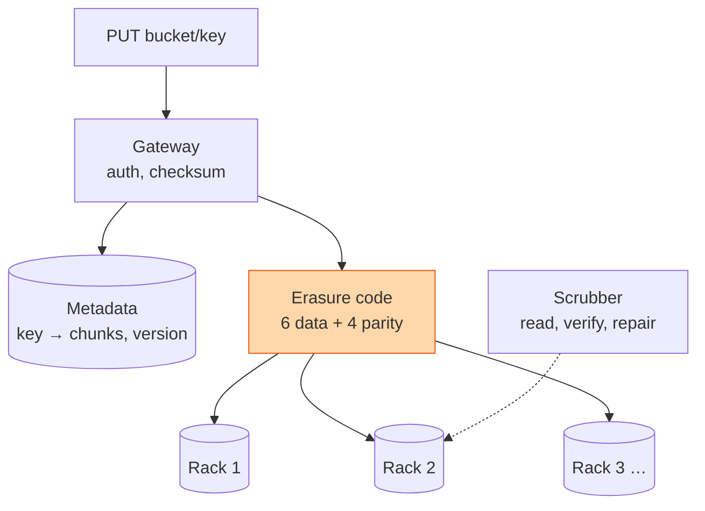

## The question

Design a service like S3. Put an object under a key in a bucket. Get it back. Exabytes, billions of objects, disks failing every hour, and eleven nines of durability.

## Explain it to a ten-year-old

You have a huge drawing you want kept safe for years. You cut it into six pieces and make four extra "spare" pieces that can rebuild any missing part. You hide the ten pieces in ten different houses. A house can burn down, three can, and your drawing survives. The school office keeps a list: your name, and which houses have your pieces. And every week someone walks round the houses and checks the pieces are not fading, and makes a new one if they are. The office list is the metadata. The houses are the storage nodes. The walk round is the scrubber.

## The trick

Separate the name from the bytes. The metadata store knows where every object's pieces are; the storage nodes only know pieces. Then use erasure coding instead of three full copies: ten pieces from which any six rebuild the object costs 1.7 times the data instead of 3 times, and survives four failures instead of two. Durability is not a number you promise, it is a repair rate you sustain.

## The steps

1. **Say the number.** An exabyte is a million terabytes. Twenty-terabyte disks means fifty thousand disks, and at a two percent yearly failure rate that is three disk deaths a day. Repair is the normal state.
2. **Gateway.** Authenticate, checksum the incoming bytes, stream them to the coder. Large objects are uploaded in parts and stitched by metadata, never held in memory.
3. **Metadata.** A key-value store, sharded by bucket and key, replicated with strong consistency. This is the small, hot, precious part. A lost piece is repairable; a lost metadata row is a lost object.
4. **Placement.** Pieces of one object go to different racks, and for the big spend, different buildings. The failure you are surviving is a rack losing power, not a disk.
5. **Durability.** Erasure coding for big objects, three copies for tiny ones where the coding overhead is silly. Both need the scrubber: read every piece on a schedule, compare checksums, rebuild what is wrong before a second failure lands.
6. **Consistency.** Read-after-write for new keys. Say what happens on overwrite: last write wins, and versioning if the customer wants history.
7. **Deletes.** Mark in metadata, reclaim pieces later in bulk. A synchronous delete across ten nodes is slow and fails half way.

## What I am listening for

- Whether you split metadata from data. If they are one system, every listing call competes with every download.
- Whether "erasure coding" appears, or at least "more than three copies costs too much".
- Whether repair is a background loop in your design. Durability numbers come from repair speed, not from copy count.


- **Metadata is small and precious. Data is big and repairable.**
- **Erasure code: 6 + 4 survives four failures at 1.7× cost.**
- **Pieces on different racks.** The failure is a rack, not a disk.
- **Durability is a repair rate.** The scrubber never stops.


## Go deeper

- Werner Vogels on [Amazon's Dynamo](https://www.allthingsdistributed.com/2007/10/amazons_dynamo.html) for the metadata half of this design.
- The [Google File System paper](https://research.google/pubs/) is the ancestor of every object store. Search for it on that page.

**With AI on the table.** The assistant draws S3 from the whitepapers. I ask how long a rebuild of one failed twenty-terabyte disk takes on your design, and how many other disks may fail during that window before you lose an object. Show me the arithmetic.
