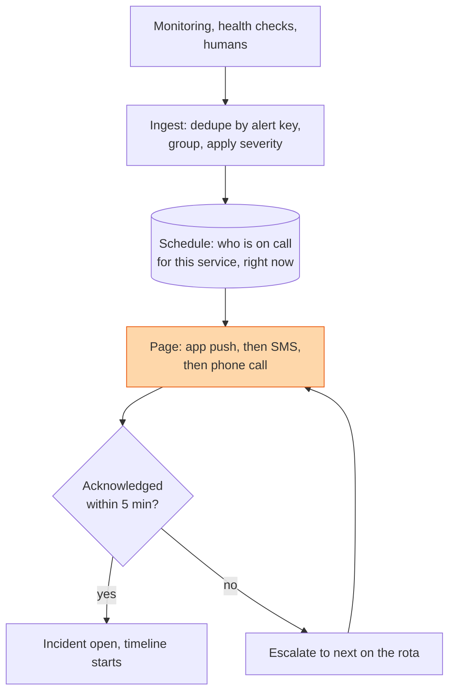

## The question

Design the service that takes alerts from monitoring, works out who is on call, pages them by phone and app, waits for an acknowledgement, and escalates if none arrives.

## Explain it to a ten-year-old

The smoke alarm goes off at night. It does not send an email. It makes a noise that wakes the person whose turn it is to check. If that person does not get up in two minutes, it wakes the next person. If nobody gets up, it calls the fire station. It runs on its own battery, because the one thing you know about a house fire is that the electricity might be off. A paging system is the smoke alarm for a company.

## The trick

Three things matter more than the rest. Dedupe, so one broken disk does not send four hundred pages. A schedule that is boring and correct, with overrides for holidays and a clear next-in-line. And independence: the pager must run on different infrastructure from the things it pages about, with its own network paths, or it dies in the same outage it was meant to report.

## The steps

1. **Ingest.** Every alert carries a key: service plus check plus target. Same key within a window is one incident, count incremented. Group related keys, like ten hosts in one rack, into one page with a count. A page says "12 hosts in rack 7" not twelve pages.
2. **Severity.** Page for things that need a human now. Ticket for things that can wait until morning. Nothing else. Every page that did not need a human at 3am erodes the rota's trust in the next one.
3. **Schedule.** Rotations, overrides, time zones, a primary and a secondary per service. Stored simply and previewable a month ahead. The single most common paging failure is a schedule with a gap.
4. **Delivery.** App push first, SMS after a minute, voice call after three. Different carriers for SMS and voice. If every channel goes through one provider, that provider is your single point of failure.
5. **Acknowledgement and escalation.** No ack within five minutes, page the secondary. No ack in ten, page the manager. Log every step with timestamps. The timeline is the start of the postmortem.
6. **Independence.** Separate cloud account, separate region, separate DNS, separate credentials. The paging system's own monitoring pages a different paging system, or a phone tree on paper.
7. **Say the number.** Alerts per day at a large fleet are tens of thousands. Pages should be tens. If the ratio is worse than a thousand to one, fix the alerts before the pager.

## In GPU infrastructure

The GPU fleet rota is this drawing and the ingest step is where it lives or dies. A rack losing a power feed produces one alert per node, one per NIC, and one per GPU, so the key is service plus check plus target and the grouping rule turns eight hundred alerts into one page that says a rack number. XID errors page only for the codes that mean a dead GPU; the rest become a ticket for the morning. And the pager runs on a different region and a different set of credentials from the fleet it watches, because the outage you most need to hear about is the one that took the management plane with it.

## What I am listening for

- Whether dedupe and grouping come first. A pager without them is a denial-of-service on the on-call engineer.
- Whether the pager depends on the thing it pages about. Draw the dependency arrows and look for a loop.
- Whether you have an opinion on what deserves a page. Most candidates have never been woken up by a bad one. It shows.


- **Dedupe by key, group by cause. One page per problem.**
- **Page only what needs a human now.**
- **Escalate on no ack.** Primary, secondary, manager, with timestamps.
- **The pager depends on nothing you run.**


## Go deeper

- The [Google SRE book](https://sre.google/sre-book/table-of-contents/) chapters on being on call and on practical alerting are the standard. Read the alerting one twice.
- The [SRE workbook](https://sre.google/workbook/table-of-contents/) chapter on alerting on SLOs, for how to turn a hundred noisy alerts into three that matter.

**With AI on the table.** The assistant draws the escalation chain. I describe an outage where your DNS provider is down and your paging app, SMS gateway and status page all use it. Who gets woken up, and how? If the answer is nobody, redesign it in front of me.
