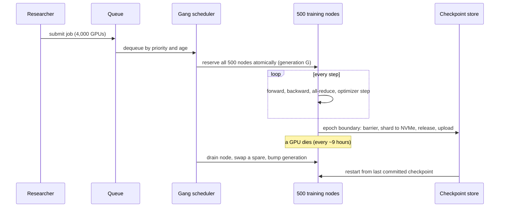

## The question

Design the infrastructure for training large language models at scale. Several models and several versions train in parallel. Assume one data centre with a twin site nearby.

That is the whole prompt. Nothing in it gives you a scale, a tenant model or a deliverable, so the first eight minutes are yours to turn it into a specification. Two follow-ups almost always arrive: how do you allocate nodes to one job, and how do you checkpoint a model spread across a hundred GPUs that share no bus.

## Explain it to a ten-year-old

A thousand people are building one enormous Lego castle together. Every person builds their own corner, and then everybody must stop and show each other what they built, because the next piece depends on all of it. If one person leaves the room, nobody can carry on. So you need three things. A rule that nobody starts until everyone is in the room. A photograph of the whole castle taken every so often, with everyone standing still while it is taken. And a bench of spare builders, because with a thousand people somebody is always going home sick.

## The trick

Compute the failure rate before you design anything, and let it drive every decision.

Twenty thousand GPUs at eight per node is 2,500 nodes. A four-thousand-GPU job occupies 500 of them. If a node survives six months on average, then 500 nodes together produce a failure about every nine hours. A three-week training run will be interrupted roughly fifty times.

Once you have said that out loud, the rest of the design is forced. You cannot prevent the failures, so you must make each one cheap. That means checkpoints, which means a barrier, which means the checkpoint interval is a trade between lost work and lost throughput. It also means a spare pool, and a scheduler that can swap a node in without a human. Nobody needs to be persuaded of any of it, because the number did the persuading.

The second idea is smaller and just as useful. A training job is a **gang**. Allocate all four thousand GPUs or none. A job holding 3,999 of them produces nothing while burning all of them, because every rank waits at the collective.

## The steps

1. **Ask five questions, not nine.** Pretraining, fine-tuning or reinforcement learning on one fleet? Total GPUs and the largest single job? One region, or may a job span sites? Who submits, and what is the priority order between them? Does done mean a registered model version?
2. **Write the functional list, and do not forget the output.** A user submits a job, it starts only when every GPU is ready, they watch step and loss and failures, and **they get the trained model back as a registered version**. The commonest miss in this question is designing a system whose user receives nothing.
3. **Name the technical challenges.** A job is a gang. One dead GPU kills it. Checkpointing needs a barrier across ranks. The fabric decides placement. An idle GPU is money burned.
4. **Say the numbers.** 2,500 nodes. Jobs of 64 to 4,096 GPUs. A hundred billion parameters at sixteen bytes each, weights plus optimizer moments, is about 1.6 TB of state. A failure every nine hours.
5. **Entities, with a generation on the job and the allocation.** Team, Job, Allocation, Node, Checkpoint, Dataset, Quota, HealthEvent. Say what is not an entity: the GPU alone is a field of the node, the epoch is a counter, the weights are the content of a checkpoint.
6. **Endpoints, with their semantics as you write them.** Submitting a job is idempotent on a client key. Reading a job returns the last **committed** checkpoint. Every internal report carries a generation, so a rank that comes back from the dead is fenced.
7. **The gang scheduler.** Dequeue by priority and age. Find N healthy nodes **inside one fabric island** that already hold the base model. Reserve them atomically with a new generation. If you cannot find them all, wait. Never half-start.
8. **Placement is a constraint, not a preference.** NVLink inside the node, rail-optimised fabric inside the island. A job split across islands pays a bandwidth tax on every all-reduce, which is every step, for the life of the run.
9. **Hot and cold pools.** Keep seventy percent of nodes hot, holding the frequently used base models on local NVMe so a start takes minutes rather than a long copy from object storage. Thirty percent cold for someone training a new base model. It is a cache, the eviction policy is base-model frequency, and the cost is capacity held idle for speed. Say that cost out loud.
10. **Checkpoint in four steps, and the order is the answer.** Barrier every rank. Each rank snapshots its own shard of weights and optimizer state from VRAM to local NVMe, about four hundred megabytes, under a second. Release the barrier so training resumes. Then stream NVMe to object storage in chunks, asynchronously, and commit the manifest last. The checkpoint does not exist until the manifest commits, and the previous one is not deleted until it does.
11. **Align checkpoints to epochs, not to a timer.** Researchers measure quality per epoch and restart from an epoch. A checkpoint in the middle of a pass is a point nobody can reason about. It is also cheaper: sixty seconds every twenty minutes costs five percent of the fleet, while an hourly epoch boundary costs under two.
12. **Handle three kinds of failure, not one.** Fail-stop, a GPU off the bus or an ECC error or a dead link: detect, drain, swap a spare, bump the generation, restart from the last checkpoint. Fail-slow, a straggler: detect by step-time outlier against the gang's own distribution, because one slow rank slows all four thousand and nothing alarms. Silent corruption, the accelerator that is wrong rather than dead: per-rank gradient-norm outliers and occasional shadow recompute.
13. **Keep the data path out of the step loop.** Shard the dataset, cache shards on NVMe near the nodes that read them, and keep a seeded deterministic order with the cursor stored alongside the checkpoint, so a restart resumes the exact position.
14. **Pick one metric: goodput.** GPU-hours that produced committed steps, divided by GPU-hours allocated. Utilisation says the GPUs were busy, which a restart loop also satisfies. Goodput catches stragglers, restarts and checkpoint overhead in one number.

## The board

<figure class="excalidraw-embed">

<figcaption>LLM training infrastructure at scale. <a href="https://excalidraw.com/#url=https://www.rik-kisnah.ai/teach/systems/llm-training-infra-answer-board.excalidraw" target="_blank" rel="noopener">Edit your own copy in Excalidraw</a> · <a href="/teach/systems/llm-training-infra-answer-board.excalidraw">download .excalidraw</a></figcaption>
</figure>

[Download the one-page cheat sheet](/teach/systems/llm-training-infra-cheat-sheet.pdf) (A4, two sides: front is the five questions, the entities, the endpoints and the minute budget; back is the board above).

## The numbers to say out loud

| Quantity | Value | Why it decides something |
|---|---|---|
| Fleet | 20,000 GPUs, 8 per node, 2,500 nodes | The unit of allocation is the node, not the GPU |
| One job | 64 to 4,096 GPUs | Training needs tens to thousands, unlike inference |
| Failure rate | 500 nodes at 6-month MTBF fail every ~9 hours | Restart cost, not peak throughput, drives the design |
| Model state | 100B params × 16 bytes ≈ 1.6 TB | Weights plus optimizer moments, sharded across ranks |
| Per-rank shard | ~400 MB; VRAM to NVMe under a second | The barrier is the cost, not the bytes |
| Checkpoint overhead | 60 s every 20 min is 5% of the fleet; hourly is under 2% | The interval is a trade, and you should name both sides |
| Lost work on a crash | Half the checkpoint interval | The one-line justification for the interval you chose |

## In GPU infrastructure

This is the shape of the job rather than an interview exercise, and the parts that look like detail are the parts that cost money. Gang reservation is why a scheduler for training looks nothing like a scheduler for web services. Topology awareness is why two identical-looking allocations can differ by a third in throughput. The hot pool exists because copying a large base model across a fleet is slow enough to show up in a quarterly utilisation number.

The failure arithmetic is the part people underestimate first and remember longest. At a few hundred nodes, hardware failure stops being an exception to handle and becomes a scheduled event to plan around. Every design choice after that is really a choice about what a failure costs.

## What I am listening for

Whether you compute the failure rate unprompted. Whether you say "all N or none" before anyone asks about scheduling. Whether you know that the checkpoint barrier, not the upload, is what stops training. Whether you can say what is not an entity. And whether, when asked how to checkpoint a hundred GPUs that share no bus, you reach for per-rank shards and a manifest rather than trying to gather everything to one host.

## What I got wrong in the mock

Three things, and all three are worth stealing as warnings.

I left the deliverable out of the functional requirements. The coach had to point out that the engineer who submits a training job gets a trained model back. Every design ends in something the user receives, and if you cannot name it, the requirements are not finished.

I did not know the word *epoch*. The design worked anyway, because a checkpoint interval is a checkpoint interval, but the right answer is better: epochs are where researchers read quality metrics, so epochs are where a checkpoint is useful. Vocabulary is cheap to acquire and expensive to lack in front of someone who uses it daily.

And I started the high-level design at minute twenty-two. The real lesson is arithmetic again: an hour-long interview is not an hour of design. Five minutes of introductions and five minutes of your own questions come out of it, so you have forty-five to fifty. Budget ten minutes a phase and finish the diagram by minute thirty-two.


Compute the failure rate first: 500 nodes at a six-month MTBF fail every nine hours, so a long run is interrupted fifty times and restart cost drives everything. A job is a gang, all N GPUs or none. Checkpoint at a barrier, write per-rank shards to local NVMe in under a second, release the barrier, upload asynchronously, commit the manifest last. Align to epochs, because that is where quality is measured. Measure goodput, not utilisation.


## Go deeper

The interesting follow-up is the one about cost. If checkpoints now take twenty minutes, what changes? The answer is that only the barrier portion stops training, so you move bytes off the critical path, shard wider so each rank writes less, overlap the upload with the next steps, and align to a boundary that is paid hourly rather than every twenty minutes. The question is really asking whether you know which part of the operation is synchronous.

The harder follow-up is stragglers. Fail-stop is easy because something announces itself. A rank running eight percent slow announces nothing, slows four thousand peers, and will not appear on any dashboard built around thresholds. Detecting it needs the gang's own step-time distribution as the baseline, which is a different kind of monitoring from the kind most fleets have.

## With AI on the table

Training infrastructure is the one area where the assistant genuinely knows the arithmetic, and that is exactly why it is worth doing by hand first. Ask a model for the checkpoint size of a hundred-billion-parameter run and it will give you a credible number instantly. Work it out yourself once, sixteen bytes a parameter for weights and optimizer moments, and the number stops being something you recall and starts being something you can adjust when the premise changes. In an interview the premise always changes.
